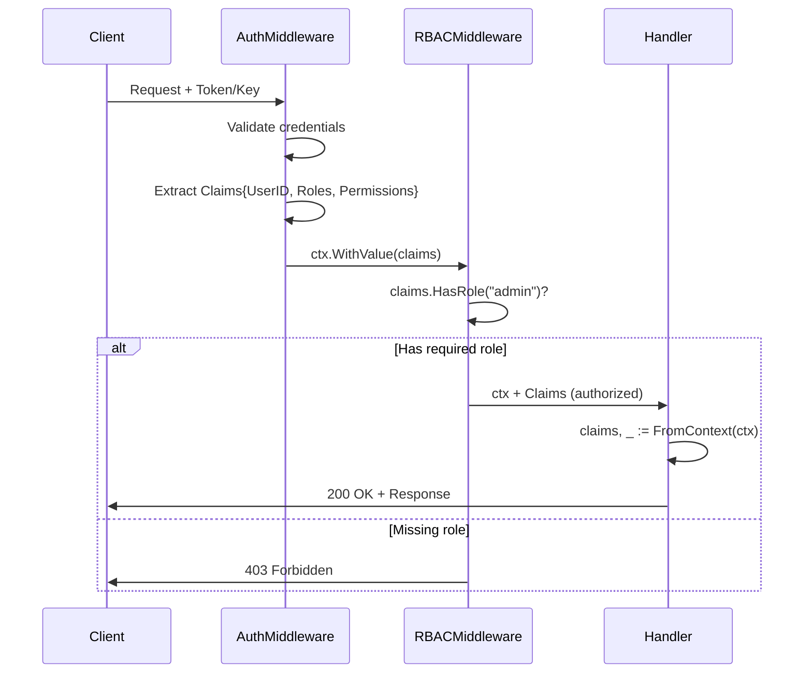
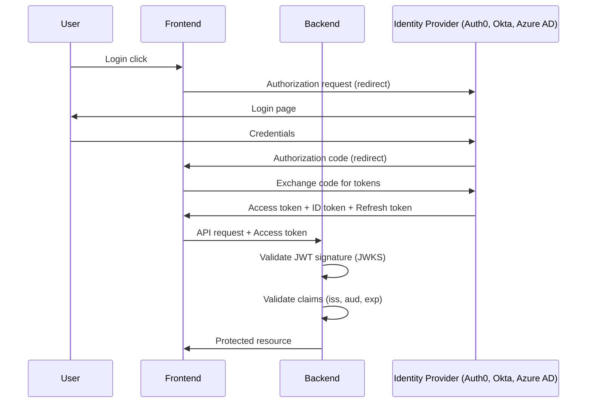

# Architecture Decision Document

_This document builds collaboratively through step-by-step discovery. Sections are appended as we work through each architectural decision together._

---

## Project Context Analysis

### Project Overview

**Name:** Backend Service Golang Boilerplate – Enterprise Golden Template
**Type:** Developer Tool / Backend Service Template
**Language:** Go 1.24.x

**Core Objectives:**
- Setup < 30 minutes (clone → running)
- First feature ≤ 2 days
- 70-80% adoption in 12 months
- Observability baseline automatic

---

### Problems Solved

| Problem | Solution |
|---------|----------|
| Repetitive setup | One-command template |
| Inconsistent patterns | Enforced hexagonal structure |
| Missing prod basics | Three Pillars default |
| Slow onboarding | AGENTS.md + example module |

---

### Architectural Style

**Style:** Hexagonal / Clean Architecture

```
interface (HTTP, jobs)
    ↓
usecase (application logic)
    ↓
domain (entities, rules)
    ↓
infra (DB, external)
```

**Philosophy:**
- **Three Pillars:** Berjalan – Diamati – Dipercaya
- **Opinionated but not locking:** Clear stack + hook interfaces
- **AI-native:** AGENTS.md as explicit contract

---

### Technical Constraints

| Component | Choice | Rationale |
|-----------|--------|-----------|
| Runtime | Go 1.24.x | Modern, stable |
| Router | chi | Lightweight, idiomatic |
| Database | PostgreSQL + pgx + sqlc | Type-safe SQL |
| Logger | zap | Structured, fast |
| Config | koanf | Flexible, typed |
| Tracing | OpenTelemetry | Industry standard |
| Metrics | Prometheus | Cloud-native |

**Out of Scope v1:** gRPC, GraphQL, multi-DB

> [!NOTE]
> **Security Headers:** For production deployments, consider adding security headers middleware (HSTS, X-Content-Type-Options, X-Frame-Options, CSP). These are typically configured at the reverse proxy layer (nginx, Traefik) but can be added as Go middleware if needed.

---

### Cross-Cutting Concerns

| Concern | Architectural Implication |
|---------|--------------------------|
| Logging | Consistent pattern, trace/request ID correlation |
| Tracing | Context flows HTTP → usecase → infra via OTEL |
| Errors | AppError model, consistent mapping to HTTP |
| Config | Centralized, accessible without globals |
| Testing | Layer-specific patterns (unit/integration) |

---

### Stakeholders

| Persona | Focus |
|---------|-------|
| Andi (Engineer) | Fast setup, domain logic |
| Rudi (Tech Lead) | Standards, architecture |
| Maya (SRE) | Observability, reliability |
| Dina (Junior) | Onboarding, learning |
| AI Assistant | AGENTS.md compliance |

---

## Technology Stack (Confirmed)

*Note: This boilerplate IS the starter template. Stack decisions from PRD confirmed.*

| Component | Package | Rationale |
|-----------|---------|-----------|
| **Go** | 1.24.x | Modern, stable |
| **Router** | go-chi/chi/v5 | Lightweight, idiomatic |
| **Database** | jackc/pgx/v5 | Fast, pure Go |
| **Query** | sqlc-dev/sqlc | Type-safe SQL |
| **Logger** | go.uber.org/zap | Structured, fast |
| **Config** | knadh/koanf/v2 | Flexible, typed |
| **Tracing** | go.opentelemetry.io/otel | Industry standard |
| **Testing** | stretchr/testify | Assertion library |
| **Linting** | golangci-lint | Curated rules |

---

## Core Architectural Decisions

### Data Architecture

#### Migration Tool
**Decision:** golang-migrate
- Folder: `db/migrations`
- Naming: `YYYYMMDDHHMMSS_description.{up,down}.sql`

#### Connection Pool
| Setting | Env Var | Default |
|---------|---------|---------|
| Max open | `DB_MAX_OPEN_CONNS` | 20 |
| Max idle | `DB_MAX_IDLE_CONNS` | 5 |
| Lifetime | `DB_CONN_MAX_LIFETIME` | 30m |

#### Transaction Pattern
**TxManager interface:** Keeps usecase layer SQL-agnostic

---

### Security Baseline

#### Middleware Order (outer → inner)
1. Recovery → 2. Request ID → 3. OTEL → 4. Logging → 5. Rate Limiting → 6. Authentication → 7. Authorization → 8. Handler

#### Validation
- **HTTP:** go-playground/validator
- **Domain:** Business rules → `ErrInvalidInput`

#### Error Sanitization
- Response: Generic messages
- Logs: Full details, no secrets

---

## Security Architecture

### Authentication vs Authorization

| Concept | Responsibility | Implementation | Response on Failure |
|---------|----------------|----------------|---------------------|
| Authentication | Verify identity ("Who are you?") | `Authenticator` interface | 401 Unauthorized |
| Authorization | Check permissions ("Can you do this?") | `RequireRole`, `RequirePermission` | 403 Forbidden |

**Separation Principle:** Authentication validates tokens/credentials and extracts claims. Authorization uses those claims to check access. Always authenticate before authorizing.

---

### Middleware Chain (Security Order)

```
┌─────────────────────────────────────────────────────────────────────────┐
│                            HTTP Request                                  │
└─────────────────────────────────────────────────────────────────────────┘
                                    │
                                    ▼
┌─────────────────────────────────────────────────────────────────────────┐
│ 1. Recovery (outermost) - Catch panics, return 500                      │
├─────────────────────────────────────────────────────────────────────────┤
│ 2. Request ID - Generate/propagate X-Request-ID                         │
├─────────────────────────────────────────────────────────────────────────┤
│ 3. OTEL Tracing - Create span, inject trace_id                          │
├─────────────────────────────────────────────────────────────────────────┤
│ 4. Logging - Log request/response with structured fields                │
├─────────────────────────────────────────────────────────────────────────┤
│ 5. Rate Limiting - Throttle requests before auth                        │
├─────────────────────────────────────────────────────────────────────────┤
│ 6. Authentication - Validate token/key, extract Claims                  │
│    └── Stores Claims in context: middleware.NewContext(ctx, claims)     │
├─────────────────────────────────────────────────────────────────────────┤
│ 7. Authorization - Check role/permission from Claims                    │
│    └── Reads Claims from context: middleware.FromContext(ctx)           │
├─────────────────────────────────────────────────────────────────────────┤
│ 8. Handler (innermost) - Business logic                                 │
│    └── Access Claims via: middleware.FromContext(r.Context())           │
└─────────────────────────────────────────────────────────────────────────┘
```

**Key Points:**
- Rate limiting before auth prevents DoS on expensive token validation
- Auth middleware stores claims in context for downstream use
- Authorization middleware and handlers read claims from same context

---

### Claims Propagation



**Claims Struct:**

```go
type Claims struct {
    UserID      string            `json:"user_id"`      // From "sub" claim
    Roles       []string          `json:"roles"`        // ["admin", "user"]
    Permissions []string          `json:"permissions"`  // ["note:create", "note:read"]
    Metadata    map[string]string `json:"metadata"`     // Optional extra data
}
```

**Helper Methods:**

```go
claims.HasRole("admin")           // Check if user has role
claims.HasPermission("note:read") // Check if user has permission
```

---

### Identity Provider Integration

The auth system provides extensibility via interfaces for connecting to external identity providers (SSO/IDP).

| Interface | Purpose | Location |
|-----------|---------|----------|
| `Authenticator` | Token/credential validation | `middleware/auth.go` |
| `KeyValidator` | API key backend lookup | `middleware/apikey.go` |

#### Built-in Authenticators

| Authenticator | Use Case | Header |
|---------------|----------|--------|
| `JWTAuthenticator` | User authentication (JWT tokens) | `Authorization: Bearer <token>` |
| `APIKeyAuthenticator` | Service-to-service auth | `X-API-Key: <key>` |

#### Implementing Custom Authenticator

For external SSO/IDP integration (OAuth2, OIDC, SAML), implement the `Authenticator` interface:

```go
// OIDCAuthenticator validates tokens against OIDC provider
type OIDCAuthenticator struct {
    issuer    string
    audience  string
    keySet    jwk.Set  // From lestrrat-go/jwx or similar
}

func (a *OIDCAuthenticator) Authenticate(r *http.Request) (middleware.Claims, error) {
    token := extractBearerToken(r)
    if token == "" {
        return middleware.Claims{}, middleware.ErrUnauthenticated
    }
    
    // Parse and validate JWT against JWKS
    parsed, err := jwt.Parse(token, jwt.WithKeySet(a.keySet))
    if err != nil {
        return middleware.Claims{}, middleware.ErrTokenInvalid
    }
    
    // Validate standard claims
    if parsed.Issuer() != a.issuer {
        return middleware.Claims{}, middleware.ErrTokenInvalid
    }
    
    // Map claims from OIDC token to internal struct
    return middleware.Claims{
        UserID:      parsed.Subject(),
        Roles:       extractRolesFromToken(parsed),
        Permissions: extractPermissionsFromToken(parsed),
    }, nil
}
```

#### Custom KeyValidator for API Keys

For database or external API key validation:

```go
type DBKeyValidator struct {
    db *sql.DB
}

func (v *DBKeyValidator) Validate(ctx context.Context, key string) (*middleware.KeyInfo, error) {
    // SECURITY: Never log the key value
    var info middleware.KeyInfo
    err := v.db.QueryRowContext(ctx, 
        "SELECT service_id, roles FROM api_keys WHERE key_hash = $1 AND revoked = false",
        hashKey(key), // Always hash API keys before lookup
    ).Scan(&info.ServiceID, pq.Array(&info.Roles))
    if err == sql.ErrNoRows {
        return nil, middleware.ErrTokenInvalid
    }
    return &info, err
}
```

---

### OAuth2/OIDC Integration Pattern



#### JWKS Integration

For production OIDC validation, use JWKS (JSON Web Key Set) to validate token signatures:

```go
import "github.com/lestrrat-go/jwx/v2/jwk"

// Initialize JWKS with auto-refresh
ctx := context.Background()
cache := jwk.NewCache(ctx)

// Register JWKS endpoint with auto-refresh
err := cache.Register(
    "https://idp.example.com/.well-known/jwks.json",
    jwk.WithMinRefreshInterval(15*time.Minute),
)

// Use in validation
keySet, err := cache.Get(ctx, "https://idp.example.com/.well-known/jwks.json")
```

#### Configuration for Common Providers

| Provider | JWKS URL Pattern |
|----------|------------------|
| Auth0 | `https://{tenant}.auth0.com/.well-known/jwks.json` |
| Okta | `https://{org}.okta.com/oauth2/default/v1/keys` |
| Azure AD | `https://login.microsoftonline.com/{tenant}/discovery/v2.0/keys` |
| Google | `https://www.googleapis.com/oauth2/v3/certs` |
| Keycloak | `https://{host}/realms/{realm}/protocol/openid-connect/certs` |

#### Claim Mapping

Standard OIDC claims to internal Claims struct:

| OIDC Claim | Internal Field | Notes |
|------------|----------------|-------|
| `sub` | `UserID` | Unique user identifier |
| `roles` / `groups` | `Roles` | Provider-specific claim name |
| `permissions` / `scope` | `Permissions` | May need parsing (space-separated) |
| `email` | `Metadata["email"]` | Optional |

---

### Authorization Patterns (RBAC)

#### Role Hierarchy

| Role | Hierarchy | Typical Use |
|------|-----------|-------------|
| `admin` | Highest | Full system access |
| `service` | Middle | Machine-to-machine API calls |
| `user` | Base | Standard user access |

#### RBAC Middleware

| Middleware | Logic | Use Case |
|------------|-------|----------|
| `RequireRole(roles...)` | OR | User has ANY of the roles |
| `RequirePermission(perms...)` | AND | User has ALL permissions |
| `RequireAnyPermission(perms...)` | OR | User has ANY permission |

#### Usage Examples

```go
// Route-level protection with roles
r.Group(func(r chi.Router) {
    r.Use(middleware.AuthMiddleware(jwtAuth))
    r.Use(middleware.RequireRole("admin", "service")) // Either role
    r.Delete("/api/v1/users/{id}", deleteUserHandler)
})

// Permission-based access
r.Group(func(r chi.Router) {
    r.Use(middleware.AuthMiddleware(jwtAuth))
    r.Use(middleware.RequirePermission("note:create", "note:read")) // Both required
    r.Post("/api/v1/notes", createNoteHandler)
})

// Combining auth providers (e.g., JWT OR API Key)
// Use separate route groups or implement a CompositeAuthenticator
publicAPI := r.Group(func(r chi.Router) {
    r.Use(middleware.AuthMiddleware(jwtAuth))
    // User-facing routes
})

internalAPI := r.Group(func(r chi.Router) {
    r.Use(middleware.AuthMiddleware(apiKeyAuth))
    r.Use(middleware.RequireRole("service"))
    // Service-to-service routes
})
```

---

### Security Best Practices

| Practice | Implementation | Rationale |
|----------|----------------|-----------|
| **Fail-closed** | Missing token → 401 Unauthorized | Never default to "allow" |
| **Secret rotation** | Use JWKS with auto-refresh | Keys can be rotated without deploy |
| **Audit logging** | Log auth decisions at INFO level | Compliance and debugging |
| **Rate limit auth** | Apply rate limiting before authentication | Prevents DoS on token validation |
| **Token validation** | Always validate `iss`, `aud`, `exp`, `nbf` | Prevents token reuse attacks |
| **Error sanitization** | Don't expose parsing errors to clients | Prevents information leakage |
| **Minimum key length** | JWT secret ≥ 32 bytes | HMAC-SHA256 security |
| **Constant-time comparison** | Use `subtle.ConstantTimeCompare` for secrets | Prevents timing attacks |

#### Sentinel Errors

| Error | HTTP Status | Meaning |
|-------|-------------|---------|
| `ErrUnauthenticated` | 401 | No credentials provided |
| `ErrTokenInvalid` | 401 | Invalid token format/signature |
| `ErrTokenExpired` | 401 | Token has expired |
| `ErrForbidden` | 403 | Authenticated but not authorized |
| `ErrInsufficientRole` | 403 | Missing required role |
| `ErrInsufficientPermission` | 403 | Missing required permission |

---

### API Patterns

#### Response Envelope
```json
{"success": bool, "data": {}, "error": {"code": "ERR_*", "message": ""}}
```

#### Error Codes
| Code | HTTP |
|------|------|
| ERR_BAD_REQUEST | 400 |
| ERR_UNAUTHORIZED | 401 |
| ERR_FORBIDDEN | 403 |
| ERR_RESOURCE_NOT_FOUND | 404 |
| ERR_CONFLICT | 409 |
| ERR_INTERNAL | 500 |

#### Pagination
Limit/offset: `page`, `page_size` (default 20, max 100)

---

### Infrastructure & DX

#### Docker-Compose
| Service | Purpose |
|---------|---------|
| postgres | Database |
| jaeger | Tracing (optional) |

#### Makefile
| Target | Action |
|--------|--------|
| dev | docker-compose + go run |
| test | go test ./... |
| lint | golangci-lint |
| migrate-up/down | Migration |
| gen | sqlc generate |

#### Environment Variables
| Prefix | Variables |
|--------|-----------|
| APP_ | NAME, ENV, HTTP_PORT |
| DB_ | DSN, MAX_*_CONNS |
| OTEL_ | ENDPOINT, SERVICE_NAME |
| LOG_ | LEVEL, FORMAT |

#### Operational Runbooks

Incident response runbooks for each alert type are in `docs/runbook/`:

| Category | Runbooks |
|----------|----------|
| HTTP Service | high-error-rate.md, high-latency.md, service-down.md |
| Database | db-connection-exhausted.md, db-slow-queries.md |
| Job Queue | job-queue-backlog.md, job-failure-rate.md |

Each runbook includes: symptoms, diagnosis, common causes, remediation, and escalation paths. See `docs/runbook/README.md` for full index and `docs/runbook/template.md` for creating new runbooks.

---

## Implementation Patterns & Consistency Rules

### Naming Patterns

#### Structs & JSON
- Go fields: `PascalCase`
- JSON tags: `snake_case`
- Optional: add `omitempty`

#### Files
- Pattern: `lower_snake_case.go`
- Form: **singular** (`handler.go`, `entity.go`)
- Tests: co-located (`handler_test.go`)

#### Packages
- **lowercase**, no underscore, singular
- Domain: `internal/domain/note`
- **BANNED:** `common`, `utils`, `helpers`

---

### Testing Patterns

**Style:** Table-driven + `t.Run` + AAA

```go
func TestCreateNote(t *testing.T) {
    tests := []struct{...}{}
    for _, tt := range tests {
        t.Run(tt.name, func(t *testing.T) {
            // Arrange → Act → Assert
        })
    }
}
```

- Use `testify` (require/assert)
- `t.Parallel()` when safe
- Naming: `Test<Thing>_<Behavior>`

---

### Error Handling

**AppError:** `Code`, `Message`, `Err` (wrapped)

**Wrapping:** `fmt.Errorf("ctx: %w", err)`

**Sentinels:** in `errors.go` per domain

---

### Logging

**Context-based:** `log.FromContext(ctx)`

**HTTP Fields:** trace_id, request_id, method, path, status, duration

**Levels:** Debug (internal), Info (state change), Warn (recoverable), Error (failure)

---

### Context & Signatures

`ctx context.Context` as **first param**

Never `context.Background()` mid-chain

---

### AI Guardrails (AGENTS.md)

**MUST:**
- JSON snake_case
- ctx first param
- Error wrapping %w
- Response envelope
- Table-driven tests

**MUST NOT:**
- `common/utils/helpers`
- `context.Background()` mid-chain
- Multi-layer error logging

---

## Project Structure & Boundaries

### High-level Layout

```
golang-api-hexagonal/
├── cmd/app/main.go              # Entry point
├── internal/
│   ├── app/app.go               # Composition root
│   ├── config/                  # Config loading
│   ├── domain/note/             # Entity, errors, repo interface
│   ├── usecase/note/            # Business logic + tests
│   ├── infra/postgres/note/     # Repository impl
│   ├── interface/http/
│   │   ├── note/handler.go      # HTTP handlers
│   │   ├── httpx/               # Response helpers
│   │   ├── middleware/          # Logging, tracing, recovery
│   │   ├── router.go
│   │   └── routes.go
│   ├── observability/           # Logger, tracer, metrics
│   └── runtimeutil/             # Clock, ID gen
├── db/migrations/               # SQL migrations
├── db/queries/                  # sqlc queries
├── sqlc.yaml
├── docker-compose.yaml
├── Makefile
├── .env.example
├── .golangci.yml
├── README.md, ARCHITECTURE.md, AGENTS.md
```

---

### Layer Boundaries

| Layer | Can Import | Cannot Import |
|-------|------------|---------------|
| cmd/ | app only | everything else |
| domain | stdlib, runtimeutil | usecase, interface, infra |
| usecase | domain | infra, interface/http |
| infra | domain, observability | interface, usecase |
| interface/http | usecase, domain, httpx | infra directly |

---

### Module Pattern: note

| Layer | Location |
|-------|----------|
| Entity | internal/domain/note/ |
| Usecase | internal/usecase/note/ |
| Postgres | internal/infra/postgres/note/ |
| HTTP | internal/interface/http/note/ |

*All new modules follow this pattern.*

---

## Architecture Validation Results

### Coherence Validation ✅

**Decision Compatibility:** All technologies work together
- Go 1.24.x + chi/v5 + pgx/v5 + sqlc = modern, type-safe
- zap + OTEL = unified observability
- koanf = flexible deployment config

**Pattern Consistency:** Uniform across layers
**Structure Alignment:** Hexagonal boundaries enforced

---

### Requirements Coverage ✅

| Source | Status |
|--------|--------|
| 56 FRs | Mapped to architectural components |
| 31 NFRs | Performance, reliability, observability |
| Three Pillars | Berjalan ✅ Diamati ✅ Dipercaya ✅ |

---

### Implementation Readiness ✅

- [x] Technology versions verified
- [x] Patterns comprehensive
- [x] Structure complete
- [x] Boundaries clear
- [x] AI guardrails ready

---

### Readiness Assessment

**Status:** ✅ READY FOR IMPLEMENTATION

**Confidence:** HIGH

**Strengths:**
- Clear hexagonal architecture
- AI-native design
- Three Pillars embedded
- Comprehensive patterns

**Future:** Diagrams, ADR history

---

## Extension Interfaces

The `runtimeutil` and `observability` packages provide pluggable interfaces for external services. These allow swapping implementations without changing application code.

### Logger Interface

**Location:** `internal/observability/logger_interface.go`

```go
type Logger interface {
    Debug(msg string, fields ...Field)
    Info(msg string, fields ...Field)
    Warn(msg string, fields ...Field)
    Error(msg string, fields ...Field)
    With(fields ...Field) Logger
    Sync() error
}
```

**Default:** `ZapLogger` wraps zap.Logger  
**Testing:** `NopLogger` discards all output

---

### Cache Interface

**Location:** `internal/runtimeutil/cache.go`

```go
type Cache interface {
    Get(ctx context.Context, key string) ([]byte, error)
    Set(ctx context.Context, key string, value []byte, ttl time.Duration) error
    Delete(ctx context.Context, key string) error
    Exists(ctx context.Context, key string) (bool, error)
}
```

**Default:** `NopCache` (always misses)

**Redis Example:**
```go
type RedisCache struct {
    client *redis.Client
}

func (c *RedisCache) Get(ctx context.Context, key string) ([]byte, error) {
    val, err := c.client.Get(ctx, key).Bytes()
    if err == redis.Nil {
        return nil, runtimeutil.ErrCacheMiss
    }
    return val, err
}
```

---

### Dead Letter Queue Interface

**Location:** `internal/runtimeutil/events.go`

```go
type DeadLetterQueue interface {
    Send(ctx context.Context, event DLQEvent) error
    Close() error
}
```

**Wrapper:** `runtimeutil.NewDLQHandler(handler, dlq, config)` wraps any `EventHandler` with automatic retry and DLQ forwarding logic.

**Metrics:**
- `event_dlq_total`: Counter
- `event_dlq_errors_total`: Counter
- `event_dlq_processing_attempts`: Histogram

---

### RateLimiter Interface

**Location:** `internal/runtimeutil/ratelimiter.go`

```go
type RateLimiter interface {
    Allow(ctx context.Context, key string) (bool, error)
    Limit(ctx context.Context, key string, rate Rate) error
}

type Rate struct {
    Limit  int
    Period time.Duration
}
```

**Default:** `NopRateLimiter` (always allows)

**Middleware Usage:**
```go
func RateLimitMiddleware(limiter runtimeutil.RateLimiter) func(http.Handler) http.Handler {
    return func(next http.Handler) http.Handler {
        return http.HandlerFunc(func(w http.ResponseWriter, r *http.Request) {
            allowed, _ := limiter.Allow(r.Context(), r.RemoteAddr)
            if !allowed {
                http.Error(w, "rate limited", http.StatusTooManyRequests)
                return
            }
            next.ServeHTTP(w, r)
        })
    }
}
```

---

### EventPublisher Interface

**Location:** `internal/runtimeutil/events.go`

```go
type EventPublisher interface {
    Publish(ctx context.Context, topic string, event Event) error
    PublishAsync(ctx context.Context, topic string, event Event) error
}

type Event struct {
    ID        string
    Type      string
    Payload   json.RawMessage
    Timestamp time.Time
}
```

**Default:** `NopEventPublisher` (discards events)

**Kafka Example:**
```go
type KafkaPublisher struct {
    producer *kafka.Producer
}

func (p *KafkaPublisher) Publish(ctx context.Context, topic string, event Event) error {
    data, _ := json.Marshal(event)
    return p.producer.Produce(ctx, topic, data)
}
```

---

### EventConsumer Interface

**Location:** `internal/runtimeutil/events.go`

```go
type EventHandler func(ctx context.Context, event Event) error

type EventConsumer interface {
    Subscribe(ctx context.Context, topic string, handler EventHandler) error
    Close() error
}

type ConsumerConfig struct {
    GroupID           string        // Consumer group identifier
    MaxRetries        int           // Default: 3
    Concurrency       int           // Default: 1
    ProcessingTimeout time.Duration // Default: 30s
    AutoAck           bool          // Default: true
}
```

**Default:** `NopEventConsumer` (returns immediately)  
**Testing:** `MockEventConsumer` (simulate events)

**Sentinel Errors:**
- `ErrConsumerClosed` - Consumer has been closed
- `ErrProcessingTimeout` - Processing exceeded timeout
- `ErrMaxRetriesExceeded` - Retry limit reached

**Kafka Consumer Example:**
```go
type KafkaConsumer struct {
    consumerGroup sarama.ConsumerGroup
}

func (c *KafkaConsumer) Subscribe(ctx context.Context, topic string, handler EventHandler) error {
    return c.consumerGroup.Consume(ctx, []string{topic}, &consumerHandler{handler})
}
```

---

### SecretProvider Interface

**Location:** `internal/runtimeutil/secrets.go`

```go
type SecretProvider interface {
    GetSecret(ctx context.Context, key string) (string, error)
    GetSecretWithTTL(ctx context.Context, key string) (Secret, error)
}

type Secret struct {
    Value     string
    ExpiresAt time.Time
}
```

**Default:** `EnvSecretProvider` (reads from environment)

**Vault Example:**
```go
type VaultProvider struct {
    client *vault.Client
}

func (p *VaultProvider) GetSecret(ctx context.Context, key string) (string, error) {
    secret, err := p.client.Logical().Read(ctx, "secret/data/"+key)
    if err != nil || secret == nil {
        return "", runtimeutil.ErrSecretNotFound
    }
    return secret.Data["value"].(string), nil
}
```

---

### Registration Pattern

Wire up providers in `cmd/server/main.go`:

```go
func main() {
    // Default providers (local development)
    logger := observability.NewZapLogger(zapLogger)
    cache := runtimeutil.NewNopCache()
    rateLimiter := runtimeutil.NewNopRateLimiter()
    publisher := runtimeutil.NewNopEventPublisher()
    secrets := runtimeutil.NewEnvSecretProvider()
    
    // Production: swap with real implementations
    // cache = redis.NewRedisCache(redisClient)
    // rateLimiter = redis.NewRedisRateLimiter(redisClient)
    // publisher = kafka.NewKafkaPublisher(kafkaProducer)
    // secrets = vault.NewVaultProvider(vaultClient)
    
    // Inject into router/handlers
    deps := http.RouterDeps{
        Logger: logger,
        Cache:  cache,
        // ...
    }
}
```

**Pattern Benefits:**
- **Testability:** Use Nop implementations in tests
- **Flexibility:** Swap backends without code changes
- **Separation:** Interface in `runtimeutil`, implementation in `infra`

---

## Prometheus Alerting

The service includes pre-configured alerting rules for production monitoring at `deploy/prometheus/alerts.yaml`.

### Alert Categories

| Category | Purpose | Alerts |
|----------|---------|--------|
| HTTP Service | API health | HighErrorRate, HighLatency, ServiceDown |
| Database | Data layer health | DBConnectionExhausted, DBSlowQueries |
| Job Queue | Async processing health | JobQueueBacklog, JobFailureRate |

### Customizing Alerts

To modify thresholds, edit `deploy/prometheus/alerts.yaml`:

```yaml
- alert: HighErrorRate
  expr: |
    (sum(rate(http_requests_total{status=~"5.."}[5m])) / sum(rate(http_requests_total[5m]))) > 0.05
  for: 5m
  labels:
    severity: warning
```

**Key Fields:**
- `expr`: PromQL expression defining the condition
- `for`: Alert duration before firing
- `labels.severity`: `warning` or `critical`
- `annotations.runbook_url`: Link to troubleshooting docs

### Severity Guidelines

| Severity | When to Use | Action |
|----------|-------------|--------|
| `critical` | Immediate action required | Page on-call |
| `warning` | Investigate within 24h | Dashboard/ticket |

### Loading Rules

Rules are loaded via `rule_files` in `deploy/prometheus/prometheus.yml`. Prometheus reloads on restart or via `/-/reload` endpoint.

### Documentation References

- [AGENTS.md#Prometheus-Alerting](../AGENTS.md#-prometheus-alerting) - Complete alert list and customization patterns
- [Prometheus Alerting Rules](https://prometheus.io/docs/prometheus/latest/configuration/alerting_rules/) - Official documentation

