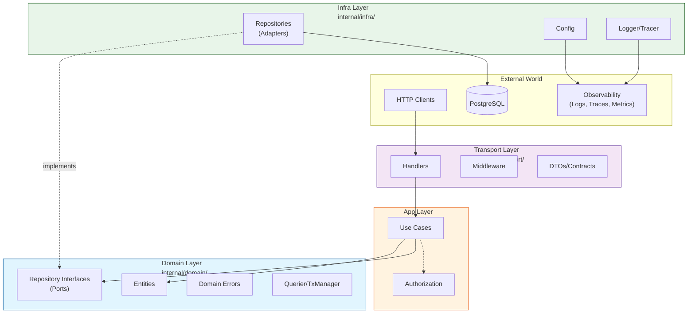

# Architecture Decision Document

_This document builds collaboratively through step-by-step discovery. Sections are appended as we work through each architectural decision together._

---

## Project Context Analysis

### Requirements Overview

**Functional Requirements:**
69 FRs organized into 10 capability areas covering project setup, reference implementation, observability, security, audit, architecture enforcement, development workflow, configuration, error handling, and documentation. The architecture must support all these capabilities while maintaining hexagonal boundary separation.

**Non-Functional Requirements:**
39 NFRs specifying code quality (80% coverage for domain/app), performance baseline (health endpoint <10ms p95), security (OWASP headers, rate limiting), reliability (graceful shutdown), portability (cross-platform), developer experience (<30min setup), and observability quality (structured JSON logs with correlation IDs).

**Scale & Complexity:**

- Primary domain: Backend API / Developer Tool (Go service boilerplate)
- Complexity level: Medium
- Estimated architectural components: 8-10 packages, 4-5 middleware, 3-4 adapters

### Technical Constraints & Dependencies

| Constraint | Impact |
|------------|--------|
| Go 1.24+ | Modern stdlib features, generics support |
| PostgreSQL 15+ | Primary datastore, JSON support |
| Docker | Required for local development |
| Hexagonal boundaries | Import rules must be enforceable via linting |
| OpenTelemetry | Standard for tracing and metrics |
| goose | Database migration tooling |

### Cross-Cutting Concerns Identified

1. **Logging & Tracing** — Consistent structured logging with request_id/trace_id propagation across all layers
2. **Error Handling** — Standard error types and response format throughout the system
3. **Request Context** — Context carrying request metadata through all layers
4. **Configuration** — Environment-based configuration with startup validation
5. **Audit Events** — Consistent audit event emission from app layer
6. **Boundary Enforcement** — Import rules preventing cross-layer violations

---

## Hexagonal Architecture Developer Guide

_This section provides a quick reference for developers to understand where to place code and how layers interact._

### Hexagonal Architecture Principles

The project follows **Hexagonal Architecture** (also known as **Ports and Adapters**), which separates business logic from external concerns:

```
        ┌─────────────────────────────────────────────────────────────┐
        │                     EXTERNAL WORLD                          │
        │   (HTTP Clients, Databases, Message Queues, File Systems)   │
        └─────────────────────────────────────────────────────────────┘
                  │                                    ▲
                  ▼                                    │
        ┌─────────────────┐                  ┌─────────────────┐
        │    ADAPTERS     │                  │    ADAPTERS     │
        │   (Driving)     │                  │   (Driven)      │
        │   Transport     │                  │   Infra         │
        └────────┬────────┘                  └────────┬────────┘
                 │                                    │
                 │         ┌──────────────────┐       │
                 └────────▶│    APPLICATION   │◀──────┘
                           │    (Use Cases)   │
                           └────────┬─────────┘
                                    │
                           ┌────────▼─────────┐
                           │     DOMAIN       │
                           │ (Entities/Ports) │
                           └──────────────────┘
```

**Core Concepts:**

| Concept | Description | In This Project |
|---------|-------------|-----------------|
| **Ports** | Interfaces defined by the domain | Repository interfaces in `internal/domain/` |
| **Adapters** | Implementations of ports | PostgreSQL repos in `internal/infra/postgres/` |
| **Driving Adapters** | Trigger application | HTTP handlers in `internal/transport/http/` |
| **Driven Adapters** | Called by application | Database, external APIs in `internal/infra/` |

**Benefits:**

1. **Testability** — Business logic can be tested without databases or HTTP
2. **Maintainability** — Changes to infrastructure don't affect domain logic
3. **Flexibility** — Swap PostgreSQL for MySQL without changing use cases
4. **Clear boundaries** — Enforced by linting, violations fail CI

---

### Four Layers and Responsibilities



**Dependency Direction:** `Transport → App → Domain ← Infra`

#### Domain Layer (`internal/domain/`)

The **innermost core** — contains business entities and contracts with NO external dependencies.

| Responsibility | Example |
|----------------|---------|
| Entity definitions | `type User struct`, `type ID string` |
| Repository interfaces (Ports) | `type UserRepository interface` |
| Domain errors | `var ErrUserNotFound = errors.New(...)` |
| Database abstractions | `type Querier interface`, `type TxManager interface` |

```go
// internal/domain/user.go
package domain

import "errors"

// Entity
type User struct {
    ID        ID
    Email     string
    FirstName string
    LastName  string
    CreatedAt time.Time
}

// Port (interface)
type UserRepository interface {
    Create(ctx context.Context, q Querier, user *User) error
    GetByID(ctx context.Context, q Querier, id ID) (*User, error)
}

// Domain error
var ErrUserNotFound = errors.New("user not found")
```

**Allowed imports:** `$gostd` only (stdlib)  
**Forbidden:** `slog`, `uuid`, `pgx`, `otel`, any external package

---

#### App Layer (`internal/app/`)

Contains **use cases** (business logic) and orchestrates domain operations.

| Responsibility | Example |
|----------------|---------|
| Use case implementation | `CreateUserUseCase.Execute()` |
| Authorization checks | Permission validation before operations |
| Transaction boundaries | Using `TxManager.WithTx()` |
| Error conversion | Domain errors → `AppError` with codes |

```go
// internal/app/user/create_user.go
package user

func (uc *CreateUserUseCase) Execute(ctx context.Context, req CreateUserRequest) (*domain.User, error) {
    // 1. Authorization check (happens HERE, not in middleware)
    if !uc.canCreate(ctx) {
        return nil, &AppError{Code: "FORBIDDEN", Message: "Not authorized"}
    }
    
    // 2. Transaction boundary
    var user *domain.User
    err := uc.txManager.WithTx(ctx, func(tx domain.Querier) error {
        user = &domain.User{ID: req.ID, Email: req.Email, ...}
        return uc.userRepo.Create(ctx, tx, user)
    })
    
    return user, err
}
```

**Allowed imports:** `$gostd`, `internal/domain`  
**Forbidden:** `slog`, `otel`, `uuid`, `net/http`, `pgx`, `transport`, `infra`

---

#### Transport Layer (`internal/transport/http/`)

**Driving adapter** — handles HTTP concerns and converts between HTTP and domain.

| Responsibility | Example |
|----------------|---------|
| HTTP handlers | `UserHandler.Create()` |
| Middleware | Auth, logging, recovery, rate limit |
| DTOs/Contracts | Request/response structs with JSON tags |
| UUID generation | Generate UUID v7 for new entities |
| Error mapping | `AppError.Code` → HTTP status + RFC 7807 |

```go
// internal/transport/http/handler/user.go
package handler

import "github.com/google/uuid"

func (h *UserHandler) Create(w http.ResponseWriter, r *http.Request) {
    // 1. Parse request
    var req contract.CreateUserRequest
    json.NewDecoder(r.Body).Decode(&req)
    
    // 2. Generate UUID v7 (at boundary)
    id, _ := uuid.NewV7()
    
    // 3. Call use case
    user, err := h.createUserUC.Execute(r.Context(), app.CreateUserRequest{
        ID:    domain.ID(id.String()),
        Email: req.Email,
    })
    
    // 4. Map errors to HTTP (ONLY place that knows HTTP status codes)
    if err != nil {
        h.writeError(w, err)
        return
    }
    
    // 5. Return response
    h.writeJSON(w, http.StatusCreated, contract.UserResponse{...})
}
```

**Allowed imports:** `domain`, `app`, `chi`, `uuid`, `stdlib`  
**Forbidden:** `pgx`, `internal/infra`

---

#### Infra Layer (`internal/infra/`)

**Driven adapters** — implements domain interfaces with concrete technology.

| Responsibility | Example |
|----------------|---------|
| Repository implementations | `postgres.UserRepo` implements `domain.UserRepository` |
| Database connections | pgxpool setup |
| Configuration | `config.Config` with envconfig |
| Observability setup | Logger, tracer, metrics initialization |

```go
// internal/infra/postgres/user_repo.go
package postgres

import "github.com/google/uuid"

func (r *UserRepo) Create(ctx context.Context, q domain.Querier, user *domain.User) error {
    op := "userRepo.Create"
    
    // Parse domain.ID to uuid.UUID at infra boundary
    id, err := uuid.Parse(string(user.ID))
    if err != nil {
        return fmt.Errorf("%s: invalid ID: %w", op, err)
    }
    
    _, err = q.Exec(ctx, `INSERT INTO users (id, email, ...) VALUES ($1, $2, ...)`, id, user.Email)
    if err != nil {
        return fmt.Errorf("%s: %w", op, err)
    }
    
    return nil
}
```

**Allowed imports:** `domain`, `pgx`, `slog`, `otel`, `uuid`, external packages  
**Forbidden:** `app`, `transport`

---

### Import Rules Between Layers

The following table shows **allowed and forbidden** imports for each layer:

| Layer | Can Import | CANNOT Import |
|-------|------------|---------------|
| **Domain** | `$gostd` only | `slog`, `uuid`, `pgx`, `otel`, ANY external |
| **App** | `$gostd`, `internal/domain` | `slog`, `otel`, `uuid`, `net/http`, `pgx`, `transport`, `infra` |
| **Transport** | `domain`, `app`, `chi`, `uuid`, `stdlib` | `pgx`, `internal/infra` |
| **Infra** | `domain`, `pgx`, `slog`, `otel`, everything | `app`, `transport` |

```
                    ALLOWED IMPORT DIRECTION
                    ========================
                    
    ┌──────────────────────────────────────────────────────┐
    │                                                      │
    │   Transport ──────────► App ──────────► Domain       │
    │                          │                ▲          │
    │                          │                │          │
    │                          ▼                │          │
    │                    ┌─────────────────────┐│          │
    │                    │       Infra        ├┘          │
    │                    │  (implements       │           │
    │                    │   domain ports)    │           │
    │                    └────────────────────┘           │
    │                                                      │
    │   ❌ Domain NEVER imports other layers               │
    │   ❌ App NEVER imports transport/infra               │
    │   ❌ Transport NEVER imports infra                   │
    │   ❌ Infra NEVER imports app/transport               │
    │                                                      │
    └──────────────────────────────────────────────────────┘
```

---

### Boundary Enforcement in Practice

Layer boundaries are **enforced automatically** by the linter. Violations fail CI.

#### Configuration Location

**File:** `.golangci.yml`  
**Linter:** `depguard` (dependency guard)

```yaml
# .golangci.yml - depguard rules excerpt
linters-settings:
  depguard:
    rules:
      domain-layer:
        list-mode: strict
        files:
          - 'internal/domain/**'
          - '!internal/domain/**/*_test.go'
        allow:
          - $gostd
        deny:
          - pkg: log/slog
            desc: Domain layer must not log
      
      app-layer:
        list-mode: strict
        files:
          - 'internal/app/**'
          - '!internal/app/**/*_test.go'
        allow:
          - $gostd
          - github.com/iruldev/golang-api-hexagonal/internal/domain
        deny:
          - pkg: log/slog
            desc: App layer must not log directly
          - pkg: github.com/jackc/pgx/v5
            desc: App layer must not import database drivers
          # ... more rules
```

#### Example Violation and Error Message

**Scenario:** Developer accidentally imports `uuid` package in app layer.

```go
// ❌ WRONG: internal/app/user/create_user.go
package user

import "github.com/google/uuid"  // VIOLATION!

func (uc *CreateUserUseCase) Execute(...) {
    id := uuid.New()  // Should not generate UUIDs here
    // ...
}
```

**Error on `make lint`:**

```
internal/app/user/create_user.go:5:2: import 'github.com/google/uuid' is not 
allowed from list 'app-layer': App layer must not import UUID library directly 
(depguard)
```

#### CI Integration

Boundary violations **automatically fail the CI build**:

```yaml
# .github/workflows/ci.yml
jobs:
  lint:
    runs-on: ubuntu-latest
    steps:
      - uses: actions/checkout@v4
      - uses: actions/setup-go@v5
        with:
          go-version-file: 'go.mod'
      - name: Run golangci-lint
        uses: golangci/golangci-lint-action@v4
        with:
          version: latest
```

**Enforcement Flow:**

1. Developer pushes code with import violation
2. CI runs `golangci-lint` with depguard enabled
3. depguard detects forbidden import
4. Lint step fails with clear error message
5. Pull request cannot be merged until fixed

#### References

This boundary enforcement implements:
- **FR45:** Linting rules detect import violations between layers
- **FR46:** CI pipeline fails when boundary violations are detected  
- **FR47:** Developer receives clear error messages indicating violation

---

## Starter Template Evaluation

### Primary Technology Domain

**Backend API / Developer Tool** — Go service boilerplate built from scratch with curated technology choices. This project IS the starter template, not a consumer of one.

### Starter Approach

**From-Scratch Build** dengan technology selections berdasarkan:
- Production-proven libraries
- Stdlib compatibility where possible
- Minimal dependency footprint
- 12-factor app compliance
- Hexagonal architecture support

### Technology Stack Decisions

#### Core Runtime

| Component | Selection | Version | Rationale |
|-----------|-----------|---------|-----------|
| **Language** | Go | 1.24+ | Modern stdlib features; toolchain pinned via `go.mod` |
| **HTTP Router** | Chi | v5.x | Stdlib-compatible, composable middleware, proven in production |

#### Data Layer

| Component | Selection | Rationale |
|-----------|-----------|-----------|
| **PostgreSQL Driver** | pgx v5 | Best performance, PostgreSQL-native features, excellent maintenance |
| **Migrations** | goose | Simple, SQL-based, no ORM lock-in |
| **Connection Pooling** | pgxpool | Built into pgx, production-ready |

#### Observability

| Component | Selection | Rationale |
|-----------|-----------|-----------|
| **Logging** | slog (stdlib) | Go 1.21+ standard, zero dependency, future-proof |
| **Tracing** | OpenTelemetry | Industry standard, vendor-neutral |
| **Metrics** | OpenTelemetry + Prometheus exporter | Prometheus-compatible per NFRs |

#### Configuration & Validation

| Component | Selection | Rationale |
|-----------|-----------|-----------|
| **Config** | envconfig | 12-factor compliant, minimal deps, fail-fast on startup |
| **Validation** | go-playground/validator v10 | De facto standard, struct tags, extensible |
| **Error Messages** | Struct tags + simple translation | Clean, consistent validation errors |

*Note: envconfig alternatives (sethvargo/go-envconfig, caarlos0/env) dapat dipertimbangkan untuk future versions.*

#### Development & Testing

| Component | Selection | Rationale |
|-----------|-----------|-----------|
| **Testing** | stdlib + testify | Standard assertions, no heavy frameworks |
| **Linting** | golangci-lint | Comprehensive, configurable, CI-ready |
| **Mocking** | testify/mock or mockery | Interface-based mocking |

#### Infrastructure

| Component | Selection | Rationale |
|-----------|-----------|-----------|
| **Container** | Docker | Required per PRD |
| **Local Dev** | docker compose v2 | Infrastructure dependencies |
| **Task Runner** | Makefile | Universal, no additional tooling |

### Dependency Footprint (MVP)

**Direct Dependencies:**

```
github.com/go-chi/chi/v5           # HTTP router
github.com/jackc/pgx/v5            # PostgreSQL driver
github.com/kelseyhightower/envconfig # Config loading
github.com/go-playground/validator/v10 # Validation
github.com/stretchr/testify        # Testing assertions
github.com/pressly/goose/v3        # Migrations
go.opentelemetry.io/otel           # Tracing
go.opentelemetry.io/otel/exporters/prometheus # Metrics
```

**Philosophy:** Minimal dependencies, each serving a clear purpose. No "framework" — composition of focused libraries.

### Architectural Decisions Established by Stack

**HTTP Layer:**
- Chi middleware composition pattern
- stdlib `http.Handler` compatibility
- Context-based request handling

**Data Access:**
- Repository pattern with pgx
- Prepared statements for performance
- Transaction support via pgx

**Configuration:**
- Struct-based config with env tags
- Fail-fast validation on startup
- No config files — pure environment variables

**Observability:**
- slog with JSON handler for production
- OpenTelemetry context propagation
- Prometheus metrics endpoint

**Testing:**
- Table-driven tests (Go idiom)
- testify assertions for clarity
- Interface mocking for dependencies

---

## Core Architectural Decisions

### Decision Priority Analysis

**Critical Decisions (Block Implementation):**
- Hexagonal layer structure and boundaries
- Repository pattern with Querier/Tx abstraction
- Unit of Work pattern for transactions
- Authentication/authorization placement
- Error response format (RFC 7807)

**Important Decisions (Shape Architecture):**
- API naming conventions (camelCase JSON, kebab-case paths)
- Pagination strategy (offset for MVP)
- Rate limiting approach
- CI/CD pipeline structure

**Deferred Decisions (Post-MVP):**
- sqlc integration (structure prepared)
- Cursor-based pagination
- Kubernetes manifests
- Alternative container registries setup

---

### Data Architecture

#### Repository Pattern

| Aspect | Decision | Rationale |
|--------|----------|-----------|
| **Interface Location** | `internal/domain` | Domain defines contracts, no external deps |
| **Implementation Location** | `internal/infra/postgres` | Infrastructure implements contracts |
| **Querier Abstraction** | `Querier` interface (Query, Exec, QueryRow) | Allows both `*pgx.Conn` and `pgx.Tx` |

**Repository Interface Example:**

```go
// internal/domain/user.go
type UserRepository interface {
    Create(ctx context.Context, q Querier, user *User) error
    GetByID(ctx context.Context, q Querier, id ID) (*User, error)
    List(ctx context.Context, q Querier, params ListParams) ([]User, int, error)
}

// internal/domain/querier.go
type Querier interface {
    // NOTE: Keep domain stdlib-only by avoiding pgx/pgconn types in signatures.
    // Infra adapters can return concrete driver types behind these opaque `any` values.
    Exec(ctx context.Context, sql string, args ...any) (any, error)
    Query(ctx context.Context, sql string, args ...any) (any, error)
    QueryRow(ctx context.Context, sql string, args ...any) any
}
```

#### Transaction Handling (Unit of Work)

| Aspect | Decision | Rationale |
|--------|----------|-----------|
| **Pattern** | Unit of Work (UoW) | Explicit transaction boundaries in app layer |
| **Location** | App layer (use cases) | Business logic controls transaction scope |
| **Abstraction** | `TxManager` interface | Decouples use case from pgx specifics |

**Unit of Work Pattern:**

```go
// internal/domain/tx.go
type TxManager interface {
    WithTx(ctx context.Context, fn func(tx Querier) error) error
}

// internal/app/user/create_user.go
func (uc *CreateUserUseCase) Execute(ctx context.Context, req CreateUserRequest) (*User, error) {
    var user *User
    err := uc.txManager.WithTx(ctx, func(tx domain.Querier) error {
        // All operations within transaction
        user = &domain.User{...}
        if err := uc.userRepo.Create(ctx, tx, user); err != nil {
            return err
        }
        if err := uc.auditRepo.Record(ctx, tx, auditEvent); err != nil {
            return err
        }
        return nil
    })
    return user, err
}
```

#### Query Approach

| Aspect | Decision | Rationale |
|--------|----------|-----------|
| **MVP** | Raw SQL with pgx | Simple, performant, full control |
| **Future (v2)** | sqlc-ready structure | Folder structure allows sqlc adoption |
| **Prepared Statements** | Yes, via pgx | Performance optimization |

**Structure for sqlc Compatibility:**

```
internal/infra/postgres/
├── queries/           # SQL files (sqlc-ready)
│   ├── users.sql
│   └── audit.sql
├── user_repository.go # Manual implementation (MVP)
└── sqlc/              # Generated code (v2, empty for now)
```

---

### Authentication & Security

#### JWT Authentication

| Aspect | Decision | Rationale |
|--------|----------|-----------|
| **Library** | `golang-jwt/jwt/v5` | De facto standard, actively maintained |
| **Token Location** | Authorization header (Bearer) | Standard REST pattern |
| **Claims** | Custom claims struct | Type-safe access |

**JWT Middleware (Chi):**

```go
// internal/transport/http/middleware/auth.go
func JWTAuth(secret []byte) func(http.Handler) http.Handler {
    return func(next http.Handler) http.Handler {
        return http.HandlerFunc(func(w http.ResponseWriter, r *http.Request) {
            // Extract, validate, inject claims into context
            // Return 401 if invalid/missing
        })
    }
}
```

#### Authorization

| Aspect | Decision | Rationale |
|--------|----------|-----------|
| **Location** | App layer (use cases) | Business rules belong with business logic |
| **Pattern** | Permission check at use case start | Fail fast before any DB operations |
| **Claims Access** | Via context | Middleware injects, use case extracts |

#### Rate Limiting

| Aspect | Decision | Rationale |
|--------|----------|-----------|
| **Library** | `go-chi/httprate` | Chi ecosystem, simple API |
| **Scope** | Per-client (IP or user ID) | Prevent abuse |
| **Storage** | In-memory (MVP) | Redis for distributed (v2) |

---

### API Design Standards

#### URL Structure

| Aspect | Decision | Example |
|--------|----------|---------|
| **Base Path** | `/api/v1/` | Versioned API |
| **Resource Naming** | Plural nouns, kebab-case | `/api/v1/users`, `/api/v1/audit-events` |
| **Nested Resources** | Max 2 levels | `/api/v1/users/{id}/activity` |

#### Request/Response Format

| Aspect | Decision | Example |
|--------|----------|---------|
| **JSON Field Naming** | camelCase | `{ "firstName": "John", "createdAt": "..." }` |
| **Date Format** | ISO 8601 / RFC 3339 | `2025-12-16T10:30:00Z` |
| **ID Format** | UUID v7 (time-ordered) | `019400a0-...` |

#### Pagination (MVP)

| Aspect | Decision | Rationale |
|--------|----------|-----------|
| **Style** | Offset-based | Simpler for MVP |
| **Parameters** | `?page=1&pageSize=20` | Clear semantics |
| **Response** | Include total count | Client can calculate pages |
| **Future (v2)** | Cursor-based option | Better for large datasets |

**Pagination Response:**

```json
{
  "data": [...],
  "pagination": {
    "page": 1,
    "pageSize": 20,
    "totalItems": 150,
    "totalPages": 8
  }
}
```

#### Error Format (RFC 7807 Problem Details)

| Aspect | Decision | Rationale |
|--------|----------|-----------|
| **Format** | RFC 7807 Problem Details | Industry standard |
| **Content-Type** | `application/problem+json` | Per spec |
| **Extensions** | `code`, `validationErrors` | Application-specific |

**Error Response Structure:**

```json
{
  "type": "https://api.example.com/problems/validation-error",
  "title": "Validation Error",
  "status": 400,
  "detail": "One or more fields failed validation",
  "instance": "/api/v1/users",
  "code": "VALIDATION_ERROR",
  "validationErrors": [
    {
      "field": "email",
      "message": "must be a valid email address"
    }
  ]
}
```

---

### Infrastructure & Deployment

#### CI/CD Pipeline

| Aspect | Decision | Rationale |
|--------|----------|-----------|
| **Platform** | GitHub Actions | Integrated with GitHub |
| **Triggers** | Push to main, PRs | Standard workflow |
| **Stages** | lint → test → build → boundary-check | Per PRD quality gates |

**CI Pipeline Steps:**

```yaml
jobs:
  ci:
    steps:
      - name: Lint
        run: make lint
      - name: Test
        run: make test
      - name: Build
        run: make build
      - name: Boundary Check
        run: make boundary-check
```

#### Container Strategy

| Aspect | Decision | Rationale |
|--------|----------|-----------|
| **Default Registry** | GitHub Container Registry (GHCR) | Integrated, free for public |
| **Configurability** | Registry as variable | User can use ECR/GCR/DockerHub |
| **Image Tagging** | Git SHA + semver tags | Traceability |

#### Kubernetes Readiness

| Aspect | Decision | Rationale |
|--------|----------|-----------|
| **MVP Scope** | K8s-ready, no manifests | Health probes, env config ready |
| **Health Probes** | `/health` (liveness), `/ready` (readiness) | Per PRD |
| **Config** | 12-factor (env vars) | K8s ConfigMap/Secret compatible |
| **Future (v2)** | Helm chart or Kustomize | When needed |

---

### Decision Impact Analysis

**Implementation Sequence:**

1. **Core Infrastructure** — Config loading, logging setup, DB connection
2. **Domain Layer** — Entities, repository interfaces, Querier/TxManager abstractions
3. **Infra Layer** — PostgreSQL implementations, TxManager
4. **App Layer** — Use cases with UoW pattern
5. **Transport Layer** — HTTP handlers, middleware (auth, rate limit)
6. **Observability** — Tracing, metrics integration
7. **CI/CD** — GitHub Actions pipeline

**Cross-Component Dependencies:**

| Decision | Affects |
|----------|---------|
| Querier abstraction | All repository implementations |
| UoW pattern | All multi-step use cases |
| RFC 7807 errors | All handlers, middleware |
| camelCase JSON | All DTOs, response structs |
| JWT middleware | All protected routes |

---

## Implementation Patterns & Consistency Rules

### Pattern Purpose

These patterns ensure multiple AI agents (or developers) write **consistent**, **compatible** code. Focus on **WHAT** must be consistent, not **HOW** to implement.

### Critical Conflict Points Identified

| Category | Conflict Point | Resolution |
|----------|----------------|------------|
| Database naming | Table/column case | snake_case standard |
| Go naming | Interface/method names | Go idioms + project conventions |
| API paths | Path format | kebab-case with Chi `{param}` |
| JSON fields | Field casing | camelCase |
| Error handling | Error types | Layered error strategy |
| File organization | Folder structure | Hexagonal layers |

---

### Naming Patterns

#### Database Naming (PostgreSQL)

| Element | Convention | Example |
|---------|------------|---------|
| **Tables** | snake_case, plural | `users`, `audit_events` |
| **Columns** | snake_case | `created_at`, `email` |
| **Primary Key** | `id` (UUID v7, generated by app) | `id uuid PRIMARY KEY` |
| **Foreign Keys** | `{referenced_table_singular}_id` | `user_id`, `audit_event_id` |
| **Compound FKs** | Full descriptive name | `created_by_user_id`, `approved_by_user_id` |
| **Indexes** | `idx_{table}_{columns}` | `idx_users_email` |
| **Unique Indexes** | `uniq_{table}_{columns}` | `uniq_users_email` |
| **Constraints** | `{table}_{type}_{columns}` | `users_check_email_format` |

**Example Migration:**

```sql
CREATE TABLE users (
    id UUID PRIMARY KEY,
    email VARCHAR(255) NOT NULL,
    first_name VARCHAR(100) NOT NULL,
    last_name VARCHAR(100) NOT NULL,
    created_at TIMESTAMPTZ NOT NULL DEFAULT NOW(),
    updated_at TIMESTAMPTZ NOT NULL DEFAULT NOW()
);

CREATE UNIQUE INDEX uniq_users_email ON users(email);
CREATE INDEX idx_users_created_at ON users(created_at);
```

#### Go Code Naming

| Element | Convention | Example |
|---------|------------|---------|
| **Packages** | lowercase, 1-2 words, no underscores | `user`, `auditlog`, `httputil` |
| **Interfaces** | Descriptive or -er suffix | `UserRepository`, `Querier`, `TxManager` |
| **Structs** | PascalCase | `User`, `CreateUserRequest` |
| **Exported Methods** | PascalCase, verb-first | `Create`, `GetByID`, `ListByEmail` |
| **Private** | camelCase | `validate`, `buildQuery` |
| **Constants** | PascalCase | `DefaultPageSize`, `MaxRetries` |
| **Env Var Keys** | ALL_CAPS (exception) | `DATABASE_URL`, `JWT_SECRET` |
| **Domain Errors** | `Err` prefix, sentinel | `var ErrUserNotFound = errors.New("user not found")` |

**Error Naming by Layer:**

```go
// Domain layer: sentinel errors
var ErrUserNotFound = errors.New("user not found")
var ErrEmailAlreadyExists = errors.New("email already exists")

// App layer: typed errors with Code/Op
type AppError struct {
    Op      string // operation: "CreateUser"
    Code    string // machine-readable: "USER_NOT_FOUND"
    Message string // human-readable
    Err     error  // wrapped error
}
```

#### API Naming

| Element | Convention | Example |
|---------|------------|---------|
| **Paths** | kebab-case, plural | `/api/v1/users`, `/api/v1/audit-events` |
| **Path Params** | `{id}` format (Chi) | `/api/v1/users/{id}` |
| **Query Params** | camelCase | `?page=1&pageSize=20` |
| **JSON Request Fields** | camelCase | `{ "firstName": "John" }` |
| **JSON Response Fields** | camelCase | `{ "userId": "...", "createdAt": "..." }` |
| **Timestamps** | RFC 3339 UTC | `"2025-12-16T10:30:00Z"` |
| **Headers** | Standard HTTP | `Authorization: Bearer ...` |

---

### Structure Patterns

#### File Organization

```
internal/
├── domain/                    # Domain layer (no external deps)
│   ├── user.go               # User entity + UserRepository interface
│   ├── audit.go              # AuditEvent entity + AuditRepository interface
│   ├── querier.go            # Querier interface (DB abstraction)
│   ├── tx.go                 # TxManager interface
│   └── errors.go             # Domain sentinel errors
│
├── app/                       # Application layer (use cases)
│   ├── user/
│   │   ├── create_user.go    # CreateUserUseCase
│   │   ├── get_user.go       # GetUserUseCase
│   │   └── list_users.go     # ListUsersUseCase
│   ├── audit/
│   │   └── record_event.go
│   └── errors.go             # AppError typed errors
│
├── transport/                 # Transport layer
│   └── http/
│       ├── handler/          # HTTP handlers
│       │   ├── user.go
│       │   └── health.go
│       ├── contract/         # Request/Response DTOs (API contract)
│       │   ├── user.go
│       │   └── error.go      # RFC 7807 Problem Details
│       ├── middleware/       # HTTP middleware
│       │   ├── auth.go
│       │   ├── logging.go
│       │   ├── recovery.go
│       │   └── ratelimit.go
│       └── router.go         # Chi router setup
│
├── infra/                     # Infrastructure layer
│   ├── postgres/
│   │   ├── user_repo.go      # UserRepository implementation
│   │   ├── audit_repo.go     # AuditRepository implementation
│   │   ├── tx_manager.go     # TxManager implementation
│   │   └── queries/          # SQL files (sqlc-ready)
│   │       ├── users.sql
│   │       └── audit.sql
│   └── config/
│       └── config.go         # Config struct + envconfig
│
└── pkg/                       # Shared utilities (minimal)
    └── httputil/
        └── response.go       # Response helpers
```

#### Test Location

| Test Type | Location | Naming |
|-----------|----------|--------|
| **Unit tests** | Co-located | `user_test.go` next to `user.go` |
| **Integration tests** | Same package | `user_integration_test.go` |
| **E2E tests** | `test/e2e/` | `api_test.go` |

---

### Format Patterns

#### API Response Format

**Success Response (Single Item):**

```json
{
  "data": {
    "id": "019400a0-...",
    "email": "john@example.com",
    "firstName": "John",
    "lastName": "Doe",
    "createdAt": "2025-12-16T10:30:00Z"
  }
}
```

**Success Response (List with Pagination):**

```json
{
  "data": [
    { "id": "...", "email": "..." }
  ],
  "pagination": {
    "page": 1,
    "pageSize": 20,
    "totalItems": 150,
    "totalPages": 8
  }
}
```

**Error Response (RFC 7807 Problem Details):**

```json
{
  "type": "https://api.example.com/problems/validation-error",
  "title": "Validation Error",
  "status": 400,
  "detail": "One or more fields failed validation",
  "instance": "/api/v1/users",
  "code": "VALIDATION_ERROR",
  "validationErrors": [
    { "field": "email", "message": "must be a valid email address" }
  ]
}
```

---

### Communication Patterns

#### Audit Events (NOT Logs)

| Aspect | Rule |
|--------|------|
| **Destination** | Audit sink (DB), NOT log stream |
| **Payload** | Full audit data with PII redaction |
| **Log entry** | Metadata only (event type, entity ID, timestamp) |
| **Naming** | `{entity}.{action}` format | `user.created`, `user.updated` |

**Audit Event Structure:**

```go
type AuditEvent struct {
    ID        ID
    EventType string    // "user.created"
    EntityID  ID
    ActorID   ID // who performed action
    Payload   []byte    // JSON, PII redacted
    CreatedAt time.Time
}
```

#### Logging Patterns

**Required Log Fields (All Entries):**

| Field | Source | Example |
|-------|--------|---------|
| `service` | Config | `"golang-api-hexagonal"` |
| `env` | Config | `"production"` |
| `requestId` | Context | `"req-abc123"` |
| `traceId` | Context | `"trace-xyz789"` (empty if tracing off) |

**Log Entry Example:**

```go
slog.Info("user created",
    "service", cfg.ServiceName,
    "env", cfg.Environment,
    "requestId", middleware.GetRequestID(ctx),
    "traceId", middleware.GetTraceID(ctx),
    "userId", user.ID,
)
```

**Log Levels:**

| Level | Use Case |
|-------|----------|
| `Debug` | Development diagnostics |
| `Info` | Business events, successful operations |
| `Warn` | Recoverable issues, degraded state |
| `Error` | Failures requiring attention |

**Sensitive Data:** NEVER log passwords, tokens, PII, or full request bodies.

---

### Process Patterns

#### Error Handling Strategy

**Layer Responsibilities:**

| Layer | Error Handling |
|-------|----------------|
| **Domain** | Define sentinel errors (`ErrUserNotFound`) |
| **Infra** | Wrap DB errors with `op` string |
| **App** | Convert to `AppError` with `Code` |
| **Transport** | Map `AppError.Code` to HTTP status + RFC 7807 |

**Error Wrapping Convention:**

```go
// In repository (infra layer)
func (r *UserRepo) GetByID(ctx context.Context, q Querier, id domain.ID) (*domain.User, error) {
    op := "userRepo.GetByID"
    // ... query ...
    if errors.Is(err, ErrNoRows) { // driver-specific in infra
        return nil, fmt.Errorf("%s: %w", op, domain.ErrUserNotFound)
    }
    if err != nil {
        return nil, fmt.Errorf("%s: %w", op, err)
    }
    return user, nil
}

// In use case (app layer)
func (uc *GetUserUseCase) Execute(ctx context.Context, id domain.ID) (*domain.User, error) {
    user, err := uc.userRepo.GetByID(ctx, uc.db, id)
    if errors.Is(err, domain.ErrUserNotFound) {
        return nil, &AppError{
            Op:      "GetUser",
            Code:    "USER_NOT_FOUND",
            Message: "User not found",
            Err:     err,
        }
    }
    return user, err
}

// In handler (transport layer) - ONLY place that knows HTTP
func (h *UserHandler) GetUser(w http.ResponseWriter, r *http.Request) {
    // ... call use case ...
    if err != nil {
        var appErr *app.AppError
        if errors.As(err, &appErr) {
            writeProblemJSON(w, mapCodeToStatus(appErr.Code), appErr)
            return
        }
        writeInternalError(w)
        return
    }
}
```

#### Transaction Handling

**UoW Pattern Usage:**

```go
// Use case controls transaction boundary
err := uc.txManager.WithTx(ctx, func(tx domain.Querier) error {
    // All operations use same tx
    if err := uc.userRepo.Create(ctx, tx, user); err != nil {
        return err // auto-rollback
    }
    if err := uc.auditRepo.Record(ctx, tx, event); err != nil {
        return err // auto-rollback
    }
    return nil // auto-commit
})
```

---

### Enforcement Guidelines

**All AI Agents MUST:**

1. Follow database naming conventions exactly (snake_case, plural tables)
2. Use camelCase for all JSON fields
3. Place files in correct hexagonal layer folders
4. Use `op` string pattern for error wrapping
5. Include required log fields (`service`, `env`, `requestId`, `traceId`)
6. Write audit events to sink, NOT to logs
7. Map errors to HTTP status ONLY in transport layer

**Pattern Verification:**

| Check | Tool |
|-------|------|
| Go naming | golangci-lint |
| Import boundaries | Custom lint rules / go-cleanarch |
| JSON field naming | Struct tag review |
| Test coverage | `go test -cover` |
| Log fields | Code review |

---

### Pattern Examples

**Good Examples:**

```go
// ✅ Correct package naming
package auditlog

// ✅ Correct error with op
op := "userRepo.Create"
return fmt.Errorf("%s: %w", op, err)

// ✅ Correct JSON struct tags
type CreateUserRequest struct {
    FirstName string `json:"firstName" validate:"required"`
    Email     string `json:"email" validate:"required,email"`
}

// ✅ Correct log entry
slog.Info("user created", "requestId", reqID, "userId", user.ID)
```

**Anti-Patterns:**

```go
// ❌ Wrong: underscore in package name
package audit_log

// ❌ Wrong: no op in error wrap
return fmt.Errorf("failed: %w", err)

// ❌ Wrong: snake_case JSON
type CreateUserRequest struct {
    FirstName string `json:"first_name"`
}

// ❌ Wrong: logging PII
slog.Info("user created", "email", user.Email, "password", user.Password)

// ❌ Wrong: HTTP status in domain layer
if err != nil {
    return nil, &DomainError{Status: 404} // NO! Domain doesn't know HTTP
}
```

---

## Project Structure & Boundaries

### Requirements to Structure Mapping

| FR Category | Primary Layer | Directory |
|-------------|---------------|-----------|
| **Project Setup & Bootstrap** | Root + Infra | `cmd/`, `Makefile`, `docker-compose.yaml` |
| **Reference Implementation** | All layers | `internal/*/user/` |
| **Observability** | Transport + Infra | `middleware/`, `infra/observability/` |
| **Security Baseline** | Transport + App | `middleware/`, `app/` |
| **Audit Trail** | Domain + Infra | `domain/audit.go`, `infra/postgres/audit_repo.go` |
| **Architecture Enforcement** | Root | `.golangci.yml`, `Makefile` |
| **Development Workflow** | Root | `Makefile`, `.github/workflows/` |
| **Configuration** | Infra | `infra/config/` |
| **Error Handling** | All layers | Layer-specific `errors.go` |
| **Documentation** | Root | `README.md`, `docs/` |

---

### Complete Project Directory Structure

```
golang-api-hexagonal/
├── cmd/
│   └── api/
│       └── main.go                    # Entry point, wiring, DI
│
├── internal/
│   ├── domain/                        # Domain layer (stdlib ONLY, no external deps)
│   │   ├── user.go                    # User entity + UserRepository interface
│   │   ├── audit.go                   # AuditEvent entity + AuditRepository interface
│   │   ├── id.go                      # type ID string (UUID handled at boundaries)
│   │   ├── querier.go                 # Querier interface (DB abstraction)
│   │   ├── tx.go                      # TxManager interface
│   │   └── errors.go                  # Domain sentinel errors
│   │
│   ├── app/                           # Application layer (use cases)
│   │   ├── user/
│   │   │   ├── create_user.go         # CreateUserUseCase
│   │   │   ├── create_user_test.go
│   │   │   ├── get_user.go            # GetUserUseCase
│   │   │   ├── get_user_test.go
│   │   │   ├── list_users.go          # ListUsersUseCase
│   │   │   └── list_users_test.go
│   │   ├── audit/
│   │   │   ├── record_event.go        # RecordAuditEventUseCase
│   │   │   └── record_event_test.go
│   │   └── errors.go                  # AppError typed errors (Code, Op)
│   │
│   ├── transport/                     # Transport layer
│   │   └── http/
│   │       ├── handler/               # HTTP handlers
│   │       │   ├── user.go
│   │       │   ├── user_test.go
│   │       │   ├── health.go
│   │       │   └── health_test.go
│   │       ├── contract/              # Request/Response DTOs (API contract)
│   │       │   ├── user.go            # CreateUserRequest, UserResponse
│   │       │   ├── pagination.go      # PaginatedResponse
│   │       │   └── error.go           # ProblemDetails (RFC 7807)
│   │       ├── middleware/            # HTTP middleware
│   │       │   ├── auth.go            # JWT authentication
│   │       │   ├── auth_test.go
│   │       │   ├── logging.go         # Request logging (receives *slog.Logger)
│   │       │   ├── recovery.go        # Panic recovery
│   │       │   ├── ratelimit.go       # Rate limiting
│   │       │   ├── requestid.go       # Request ID injection
│   │       │   └── cors.go            # CORS headers
│   │       ├── router.go              # Chi router setup
│   │       └── server.go              # HTTP server lifecycle
│   │
│   ├── infra/                         # Infrastructure layer
│   │   ├── postgres/
│   │   │   ├── conn.go                # Connection pool setup
│   │   │   ├── user_repo.go           # UserRepository implementation
│   │   │   ├── user_repo_test.go
│   │   │   ├── audit_repo.go          # AuditRepository implementation
│   │   │   ├── audit_repo_test.go
│   │   │   ├── tx_manager.go          # TxManager implementation
│   │   │   └── queries/               # SQL files (sqlc-ready)
│   │   │       ├── users.sql
│   │   │       └── audit.sql
│   │   ├── config/
│   │   │   ├── config.go              # Config struct + envconfig
│   │   │   └── config_test.go
│   │   └── observability/
│   │       ├── logger.go              # slog setup (JSON handler)
│   │       ├── tracer.go              # OpenTelemetry tracer setup
│   │       └── metrics.go             # Prometheus metrics setup
│   │
│   └── shared/                        # Internal shared utilities
│       ├── httputil/
│       │   ├── response.go            # JSON response helpers
│       │   └── request.go             # Request parsing helpers
│       └── validator/
│           └── validator.go           # go-playground/validator setup
│
├── migrations/                        # goose migrations
│   ├── 20251216100000_create_users.sql
│   └── 20251216100001_create_audit_events.sql
│
├── docs/                              # Documentation
│   ├── ARCHITECTURE.md                # Architecture overview
│   ├── LOCAL_DEV.md                   # Local development guide
│   └── OBSERVABILITY.md               # Observability setup
│
├── .github/
│   └── workflows/
│       └── ci.yml                     # GitHub Actions CI
│
├── .vscode/                           # VS Code config
│   ├── settings.json
│   ├── launch.json
│   └── extensions.json
│
├── .env.example                       # Environment template
├── .gitignore
├── .golangci.yml                      # Linter config with boundary rules
├── docker-compose.yaml                # Local infrastructure
├── Dockerfile                         # Multi-stage build
├── Makefile                           # Task runner
├── go.mod
├── go.sum
└── README.md
```

---

### Domain Purity: ID Handling

**Domain uses `type ID string`** to remain stdlib-only:

```go
// internal/domain/id.go
package domain

// ID represents a unique identifier (UUID string format)
// Parsing and validation happens at transport/infra boundaries
type ID string

func (id ID) String() string { return string(id) }
func (id ID) IsEmpty() bool  { return id == "" }

// Type aliases for clarity
type UserID = ID
type AuditEventID = ID
```

**UUID parsing happens at boundaries:**

```go
// internal/transport/http/handler/user.go
func (h *UserHandler) GetUser(w http.ResponseWriter, r *http.Request) {
    idParam := chi.URLParam(r, "id")
    
    // Validate UUID format at transport boundary
    if _, err := uuid.Parse(idParam); err != nil {
        writeProblemJSON(w, 400, "Invalid user ID format")
        return
    }
    
    user, err := h.getUserUC.Execute(r.Context(), domain.UserID(idParam))
    // ...
}
```

---

### Architectural Boundaries

#### Layer Import Rules (Strict)

```
┌─────────────────────────────────────────────────────────────┐
│                      cmd/api/main.go                        │
│  - Imports ALL layers (wiring)                              │
│  - Sets up logger, tracer, metrics                          │
│  - Injects dependencies to transport/infra                  │
└─────────────────────────────────────────────────────────────┘
                              │
                              ▼
┌─────────────────────────────────────────────────────────────┐
│                    transport/http/                          │
│  - Imports: domain, app                                     │
│  - Receives: *slog.Logger (injected, not imported)          │
│  - NOT: infra/postgres, infra/observability                 │
└─────────────────────────────────────────────────────────────┘
                              │
                              ▼
┌─────────────────────────────────────────────────────────────┐
│                         app/                                │
│  - Imports: domain ONLY                                     │
│  - NOT: transport, infra, slog, otel                        │
└─────────────────────────────────────────────────────────────┘
                              │
                              ▼
┌─────────────────────────────────────────────────────────────┐
│                        domain/                              │
│  - Imports: stdlib ONLY (errors, context, time, strings)    │
│  - NOT: uuid, slog, otel, pgx, chi, any external package    │
└─────────────────────────────────────────────────────────────┘
                              
┌─────────────────────────────────────────────────────────────┐
│                   infra/postgres/                           │
│  - Imports: domain, pgx, uuid                               │
│  - Implements domain interfaces                             │
└─────────────────────────────────────────────────────────────┘

┌─────────────────────────────────────────────────────────────┐
│                 infra/observability/                        │
│  - Imports: slog, otel, prometheus                          │
│  - Called by cmd/api/main.go only                           │
└─────────────────────────────────────────────────────────────┘
```

#### Boundary Enforcement (.golangci.yml)

```yaml
linters-settings:
  depguard:
    rules:
      domain:
        files:
          - "internal/domain/**/*.go"
        deny:
          - pkg: "github.com/jackc/pgx"
            desc: "domain cannot import infra packages"
          - pkg: "github.com/go-chi/chi"
            desc: "domain cannot import transport packages"
          - pkg: "github.com/google/uuid"
            desc: "domain uses type ID string, UUID parsing at boundaries"
          - pkg: "log/slog"
            desc: "domain does not log"
          - pkg: "go.opentelemetry.io"
            desc: "domain does not trace"
      app:
        files:
          - "internal/app/**/*.go"
        deny:
          - pkg: "net/http"
            desc: "app cannot import http packages"
          - pkg: "github.com/jackc/pgx"
            desc: "app cannot import infra packages"
          - pkg: "log/slog"
            desc: "app does not log directly"
          - pkg: "go.opentelemetry.io"
            desc: "app does not trace directly"
      transport:
        files:
          - "internal/transport/**/*.go"
        deny:
          - pkg: "github.com/jackc/pgx"
            desc: "transport cannot import postgres directly"
          - pkg: "internal/infra/observability"
            desc: "transport receives logger via injection"
```

---

### Integration Points

#### Dependency Injection Flow (cmd/api/main.go)

```go
func main() {
    // 1. Load config
    cfg := config.Load()
    
    // 2. Setup observability (infra/observability)
    logger := observability.NewLogger(cfg)
    tracer := observability.NewTracer(cfg)
    metrics := observability.NewMetrics()
    
    // 3. Setup database (infra/postgres)
    pool := postgres.NewPool(cfg.DatabaseURL)
    txManager := postgres.NewTxManager(pool)
    
    // 4. Create repositories (infra/postgres)
    userRepo := postgres.NewUserRepository()
    auditRepo := postgres.NewAuditRepository()
    
    // 5. Create use cases (app)
    createUserUC := user.NewCreateUserUseCase(userRepo, auditRepo, txManager)
    getUserUC := user.NewGetUserUseCase(userRepo)
    listUsersUC := user.NewListUsersUseCase(userRepo)
    
    // 6. Create handlers (transport) - inject logger
    userHandler := handler.NewUserHandler(createUserUC, getUserUC, listUsersUC, logger)
    healthHandler := handler.NewHealthHandler(pool)
    
    // 7. Setup router with middleware - inject logger
    router := http.NewRouter(userHandler, healthHandler, logger, cfg)
    
    // 8. Start server with graceful shutdown
    http.StartServer(router, cfg, logger)
}
```

#### Data Flow

```
HTTP Request
    │
    ▼
[Middleware Chain] → requestId, auth, rateLimit, logging (uses injected logger)
    │
    ▼
[Handler] → Parse request, validate UUID, call use case
    │
    ▼
[UseCase] → Business logic, authorization, audit (no logging)
    │
    ▼
[Repository] → SQL queries via Querier/Tx
    │
    ▼
[PostgreSQL]
    │
    ▼
[Response] → DTO mapping, JSON serialization (camelCase)
```

---

### Test Organization

| Test Type | Location | Build Tag | Command |
|-----------|----------|-----------|---------|
| **Unit (domain)** | `internal/domain/*_test.go` | none | `go test ./internal/domain/...` |
| **Unit (app)** | `internal/app/**/*_test.go` | none | `go test ./internal/app/...` |
| **Unit (handler)** | `internal/transport/http/handler/*_test.go` | none | `go test ./internal/transport/...` |
| **Integration (repo)** | `internal/infra/postgres/*_test.go` | `integration` | `go test -tags=integration ./internal/infra/...` |
| **E2E** | `test/e2e/` (v2) | `e2e` | Separate test suite |

---

### Key Files Explained

| File | Purpose |
|------|---------|
| `cmd/api/main.go` | Entry point, DI wiring, graceful shutdown |
| `internal/domain/id.go` | `type ID string` for UUID abstraction |
| `internal/domain/querier.go` | DB abstraction interface |
| `internal/app/errors.go` | `AppError` with Code/Op for RFC 7807 |
| `internal/transport/http/contract/error.go` | RFC 7807 ProblemDetails struct |
| `internal/infra/observability/logger.go` | slog JSON handler setup |
| `.golangci.yml` | Boundary enforcement via depguard |

---

## Architecture Validation Results

### Coherence Validation ✅

**Decision Compatibility:**
All technology choices (Go 1.24+, Chi v5, pgx v5, slog, OpenTelemetry, envconfig, go-playground/validator) are compatible and work together without conflicts. Version compatibility verified.

**Pattern Consistency:**
Implementation patterns (hexagonal layers, UoW transactions, RFC 7807 errors, structured logging) fully support and align with architectural decisions. No contradictions found.

**Structure Alignment:**
Project structure with clear layer boundaries (`domain/`, `app/`, `transport/`, `infra/`) supports all architectural decisions. Integration points properly structured with dependency injection.

---

### Requirements Coverage Validation ✅

**Functional Requirements Coverage:**
All 69 FRs across 10 capability areas have clear architectural support:
- Project Setup → `cmd/`, Makefile, docker-compose
- Observability → `infra/observability/`, `middleware/`
- Security → `middleware/auth`, `middleware/ratelimit`
- Audit → `domain/audit.go`, `infra/postgres/audit_repo`
- Architecture Enforcement → `.golangci.yml` depguard rules

**Non-Functional Requirements Coverage:**
All 39 NFRs across 7 categories architecturally supported:
- Code Quality → golangci-lint, test coverage structure
- Performance → pgx (fast), graceful shutdown
- Security → JWT, rate limiting, boundary enforcement
- Reliability → Health probes, transaction handling
- Portability → Docker, env-based config
- DX → Makefile, documentation structure
- Observability → slog JSON, correlation IDs

---

### Implementation Readiness Validation ✅

**Decision Completeness:**
- All critical decisions documented with specific versions
- Implementation patterns comprehensive with code examples
- Consistency rules enforceable via golangci-lint depguard
- Good/bad examples provided for all major patterns

**Structure Completeness:**
- Complete project tree with all files and directories
- Layer boundaries and import rules clearly defined
- DI flow documented in `cmd/api/main.go`
- Test organization with build tags specified

**Pattern Completeness:**
- All potential conflict points addressed (naming, structure, communication)
- Naming conventions comprehensive (DB, Go, API, JSON)
- Error handling strategy complete (sentinel → typed → RFC 7807)
- Logging patterns with required fields documented

---

### Gap Analysis Results

**Critical Gaps:** None ✅

**Minor Gaps Addressed:**

| Gap | Resolution |
|-----|------------|
| Secure headers middleware | Add `middleware/secureheaders.go` to project structure |
| CORS configuration | Document allowed origins pattern in middleware |

**Deferred to v2 (Not Gaps):**
- sqlc integration (structure prepared)
- Redis adapter
- gRPC transport
- Cursor pagination
- Kubernetes manifests

---

### Architecture Completeness Checklist

**✅ Requirements Analysis**
- [x] Project context thoroughly analyzed (69 FRs, 39 NFRs)
- [x] Scale and complexity assessed (Medium)
- [x] Technical constraints identified (Go 1.24+, PostgreSQL 15+, Docker)
- [x] Cross-cutting concerns mapped (logging, tracing, error handling, audit)

**✅ Architectural Decisions**
- [x] Critical decisions documented with versions
- [x] Technology stack fully specified (Chi, pgx, slog, OTel, etc.)
- [x] Integration patterns defined (DI, middleware chain)
- [x] Performance considerations addressed (pgx, graceful shutdown)

**✅ Implementation Patterns**
- [x] Naming conventions established (DB, Go, API, JSON)
- [x] Structure patterns defined (hexagonal layers, file organization)
- [x] Communication patterns specified (audit events, logging)
- [x] Process patterns documented (error handling, UoW transactions)

**✅ Project Structure**
- [x] Complete directory structure defined
- [x] Component boundaries established (depguard rules)
- [x] Integration points mapped (DI in main.go)
- [x] Requirements to structure mapping complete

---

### Architecture Readiness Assessment

**Overall Status:** ✅ READY FOR IMPLEMENTATION

**Confidence Level:** HIGH

**Key Strengths:**
1. **Pure domain layer** — `type ID string` keeps domain stdlib-only
2. **Strict boundaries** — depguard enforces layer separation in CI
3. **Consistent patterns** — comprehensive naming and error handling conventions
4. **Production-ready** — observability, security, audit built-in from start
5. **DX-focused** — Makefile, docs, <30min setup target

**Areas for Future Enhancement (v2):**
1. sqlc for type-safe SQL generation
2. Cursor-based pagination for large datasets
3. Redis adapter for caching
4. gRPC transport for service-to-service
5. Kubernetes Helm chart

---

### Implementation Handoff

**AI Agent Guidelines:**
1. Follow all architectural decisions exactly as documented
2. Use implementation patterns consistently across all components
3. Respect project structure and layer boundaries (depguard will enforce)
4. Refer to this document for all architectural questions
5. Domain layer: stdlib only, no logging, no external packages
6. App layer: domain imports only, no HTTP, no logging
7. Transport layer: receives logger via injection, maps errors to RFC 7807

**First Implementation Steps:**
1. Initialize Go module: `go mod init github.com/iruldev/golang-api-hexagonal`
2. Create project structure as defined
3. Implement `internal/domain/` (entities, interfaces, errors)
4. Implement `internal/infra/config/` (envconfig setup)
5. Implement `internal/infra/postgres/conn.go` (pgx pool)
6. Continue layer by layer following DI flow

---

## Architecture Completion Summary

### Workflow Completion

**Architecture Decision Workflow:** COMPLETED ✅
**Total Steps Completed:** 8
**Date Completed:** 2025-12-16
**Document Location:** docs/architecture.md

---

### Final Architecture Deliverables

**📋 Complete Architecture Document**
- All architectural decisions documented with specific versions
- Implementation patterns ensuring AI agent consistency
- Complete project structure with all files and directories
- Requirements to architecture mapping
- Validation confirming coherence and completeness

**🏗️ Implementation Ready Foundation**
- 25+ architectural decisions made
- 12 implementation patterns defined
- 45+ project files specified
- 69 FRs + 39 NFRs fully supported

**📚 AI Agent Implementation Guide**
- Technology stack with verified versions
- Consistency rules that prevent implementation conflicts
- Project structure with clear boundaries
- Integration patterns and communication standards

---

### Quality Assurance Checklist

**✅ Architecture Coherence**
- [x] All decisions work together without conflicts
- [x] Technology choices are compatible
- [x] Patterns support the architectural decisions
- [x] Structure aligns with all choices

**✅ Requirements Coverage**
- [x] All 69 functional requirements are supported
- [x] All 39 non-functional requirements are addressed
- [x] Cross-cutting concerns are handled
- [x] Integration points are defined

**✅ Implementation Readiness**
- [x] Decisions are specific and actionable
- [x] Patterns prevent agent conflicts
- [x] Structure is complete and unambiguous
- [x] Examples are provided for clarity

---

### Project Success Factors

**🎯 Clear Decision Framework**
Every technology choice was made collaboratively with clear rationale, ensuring all stakeholders understand the architectural direction.

**🔧 Consistency Guarantee**
Implementation patterns and rules ensure that multiple AI agents will produce compatible, consistent code that works together seamlessly.

**📋 Complete Coverage**
All project requirements are architecturally supported, with clear mapping from business needs to technical implementation.

**🏗️ Solid Foundation**
The chosen hexagonal architecture and patterns provide a production-ready foundation following international best practices.

---

**Architecture Status:** ✅ READY FOR IMPLEMENTATION

**Next Phase:** Begin implementation using the architectural decisions and patterns documented herein.

**Document Maintenance:** Update this architecture when major technical decisions are made during implementation.

---
