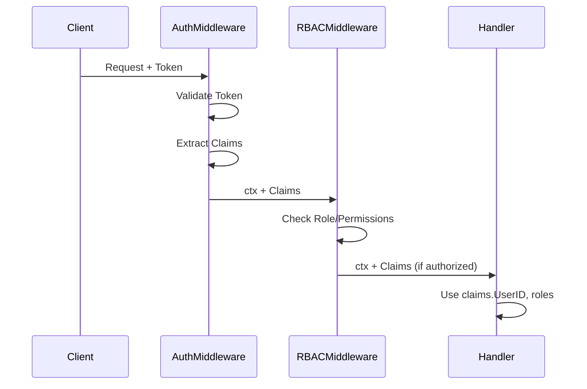
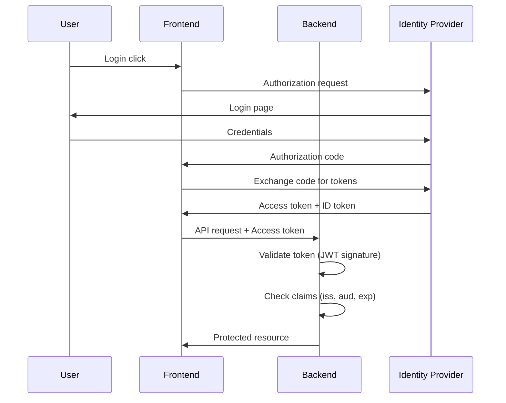

# Story 10.8: Document Auth/RBAC Integration Guide

Status: Done

## Story

As a developer,
I want documentation on integrating org SSO,
So that I can connect to existing identity systems.

## Acceptance Criteria

### AC1: Auth Middleware Architecture Documentation
**Given** ARCHITECTURE.md is updated
**When** I read the security section
**Then** auth middleware architecture is documented
**And** layer responsibilities are explained (authentication vs authorization)
**And** middleware chain order is documented
**And** claims propagation through context is explained

### AC2: SSO/IDP Integration Points Documentation
**Given** the security section exists
**When** I review IDP integration patterns
**Then** integration points for external identity providers are explained
**And** hooks for custom validators are documented
**And** token format requirements are specified
**And** claims mapping patterns are provided

### AC3: OAuth2/OIDC Example Documentation
**Given** integration patterns are documented
**When** I want to implement OAuth2/OIDC
**Then** example configuration for OIDC provider is provided
**And** token validation flow is explained
**And** claims extraction patterns are shown
**And** refresh token handling is optionally documented

---

## Tasks / Subtasks

- [x] **Task 1: Create Security Architecture Section** (AC: #1)
  - [x] Add "## Security Architecture" section to ARCHITECTURE.md
  - [x] Document authentication vs authorization distinction
  - [x] Document middleware chain order with security middleware
  - [x] Explain claims propagation pattern through context
  - [x] Add architecture diagram (mermaid) for auth flow

- [x] **Task 2: Document Auth Provider Integration Points** (AC: #2)
  - [x] Document `Authenticator` interface as integration point
  - [x] Explain how to implement custom validators
  - [x] Document `KeyValidator` interface for API key backends
  - [x] List supported token formats and how to add new ones
  - [x] Document claims mapping from external tokens

- [x] **Task 3: Create OAuth2/OIDC Integration Example** (AC: #3)
  - [x] Add OAuth2/OIDC section with standard flow diagram
  - [x] Document OIDC token validation configuration
  - [x] Provide example OIDC authenticator class outline
  - [x] Document JWKS (JSON Web Key Set) integration pattern
  - [x] Document `iss` and `aud` claim validation

- [x] **Task 4: Document Authorization Patterns** (AC: #1, #2)
  - [x] Document RBAC middleware usage patterns
  - [x] Explain role hierarchy (Admin > Service > User)
  - [x] Document permission-based authorization
  - [x] Add examples for route-level protection
  - [x] Document combining auth providers with RBAC

- [x] **Task 5: Add Security Best Practices Section** (AC: #1, #2, #3)
  - [x] Document fail-closed security posture
  - [x] Add secret management recommendations
  - [x] Document rate limiting with auth
  - [x] Add logging/auditing recommendations
  - [x] Document token refresh patterns

- [x] **Task 6: Update AGENTS.md with Integration Summary** (AC: #1)
  - [x] Add cross-reference to ARCHITECTURE.md security section
  - [x] Add "Implementing Custom Auth Provider" quick guide
  - [x] Document common mistakes to avoid

---

## Dev Notes

### Architecture Placement

This story focuses on **documentation** rather than code implementation. All deliverables are Markdown files.

**Files to Modify:**
- `docs/architecture.md` - Add comprehensive Security Architecture section
- `AGENTS.md` - Add cross-references and quick implementation guide

---

### Current State Analysis

#### Existing AGENTS.md Auth Documentation

AGENTS.md already contains implementation details for:
- `Authenticator` interface usage
- `JWTAuthenticator` with configuration options
- `APIKeyAuthenticator` with validators
- `RequireRole`, `RequirePermission` RBAC middleware
- Rate limiting middleware
- Feature flags

**Gap:** High-level architecture explanation, SSO integration patterns, OAuth2/OIDC examples

#### Existing ARCHITECTURE.md Security Section

Current content (lines 157-169):
- Middleware order mentioned briefly
- Validation patterns
- Error sanitization

**Gap:** Detailed security architecture, external IDP integration, OAuth2/OIDC patterns

---

### Content Structure for Security Section

```markdown
## Security Architecture

### Authentication vs Authorization

| Concept | Responsibility | Implementation |
|---------|---------------|----------------|
| Authentication | Verify identity | `Authenticator` interface |
| Authorization | Check permissions | `RequireRole`, `RequirePermission` |

### Middleware Chain (Security Order)

1. Recovery (outermost)
2. Request ID
3. OTEL Tracing
4. Logging
5. **Rate Limiting** ← NEW
6. **Authentication** ← NEW (validates token/key)
7. **Authorization** ← NEW (checks role/permission)
8. Handler (innermost)

### Claims Propagation


```

---

### SSO/IDP Integration Points

```markdown
### Identity Provider Integration

The auth system provides extensibility via interfaces:

| Interface | Purpose | Location |
|-----------|---------|----------|
| `Authenticator` | Token/credential validation | `middleware/auth.go` |
| `KeyValidator` | API key backend lookup | `middleware/apikey.go` |

#### Implementing Custom Authenticator

```go
// OIDCAuthenticator validates tokens against OIDC provider
type OIDCAuthenticator struct {
    issuer    string
    audience  string
    keySet    *jwk.Set  // From lestrrat-go/jwx
}

func (a *OIDCAuthenticator) Authenticate(r *http.Request) (middleware.Claims, error) {
    token := extractBearerToken(r)
    if token == "" {
        return middleware.Claims{}, middleware.ErrUnauthenticated
    }
    
    // Parse and validate JWT against JWKS
    parsed, err := jwt.Parse(token, jwt.WithKeySet(a.keySet))
    if err != nil {
        return middleware.Claims{}, middleware.ErrTokenInvalid
    }
    
    // Map claims from OIDC token
    return middleware.Claims{
        UserID:      parsed.Subject(),
        Roles:       extractRoles(parsed),
        Permissions: extractPermissions(parsed),
    }, nil
}
```

#### JWKS Integration

For production OIDC, use JWKS endpoint:

```go
// Auto-refresh JWKS from provider
ctx := context.Background()
keySet, err := jwk.Fetch(ctx, "https://idp.example.com/.well-known/jwks.json")

// Cache and auto-refresh
cache := jwk.NewCache(ctx)
cache.Register("https://idp.example.com/.well-known/jwks.json", jwk.WithMinRefreshInterval(15*time.Minute))
```
```

---

### OAuth2/OIDC Flow Example

```markdown
### OAuth2/OIDC Integration Pattern



#### Configuration for Common Providers

| Provider | JWKS URL Pattern |
|----------|-----------------|
| Auth0 | `https://{tenant}.auth0.com/.well-known/jwks.json` |
| Okta | `https://{org}.okta.com/oauth2/default/v1/keys` |
| Azure AD | `https://login.microsoftonline.com/{tenant}/discovery/v2.0/keys` |
| Google | `https://www.googleapis.com/oauth2/v3/certs` |

#### Claim Mapping

Standard OIDC claims to internal Claims struct:

| OIDC Claim | Internal Field | Notes |
|------------|---------------|-------|
| `sub` | `UserID` | Unique user identifier |
| `roles` or `groups` | `Roles` | Provider-specific claim name |
| `permissions` or `scope` | `Permissions` | May need parsing |
| `email` | `Attributes["email"]` | Optional extension |
```

---

### Previous Story Learnings (from Stories 10.1-10.7)

**From Epic 10 Implementation:**
- All auth middleware follows functional options pattern
- `Authenticator` interface is the primary extension point
- Claims struct provides `HasRole()` and `HasPermission()` helpers
- Error types: `ErrUnauthenticated`, `ErrTokenInvalid`, `ErrTokenExpired`
- RBAC middleware: `RequireRole` (OR), `RequirePermission` (AND), `RequireAnyPermission` (OR)
- Rate limiting integrates with auth (can rate limit by UserID)

**Documentation Pattern:**
- Use tables for quick reference
- Use mermaid diagrams for flows
- Provide code examples that don't compile but show patterns
- Reference existing files with links

---

### Testing Strategy

This is a documentation-only story. Validation is:

1. **Review:** Documentation is clear, accurate, and complete
2. **Cross-reference:** Examples match actual implementation
3. **Build:** `make lint` passes (if any markdown linting)
4. **Links:** All file references are valid

---

### Security Best Practices to Document

| Practice | Implementation |
|----------|---------------|
| Fail-closed | Missing token → 401, not 200 |
| Secret rotation | Use JWKS auto-refresh |
| Audit logging | Log auth decisions at info level |
| Rate limit auth | Apply rate limiting before auth to prevent DoS |
| Token validation | Always validate `iss`, `aud`, `exp` |
| Error sanitization | Don't expose JWT parsing errors to clients |

---

### References

- [Source: docs/epics.md#Story-10.8] - Story requirements
- [Source: docs/architecture.md#Security-Baseline] - Current security section
- [Source: AGENTS.md#Adding-Auth-Middleware] - Implementation details
- [Source: internal/interface/http/middleware/auth.go] - Authenticator interface
- [Source: internal/interface/http/middleware/jwt.go] - JWT implementation
- [Source: internal/interface/http/middleware/apikey.go] - API Key implementation
- [Source: internal/interface/http/middleware/rbac.go] - RBAC middleware
- [Source: internal/domain/auth/rbac.go] - Role and permission definitions
- [Source: docs/sprint-artifacts/10-7-create-feature-flag-interface-and-env-provider.md] - Previous story patterns

---

## Dev Agent Record

### Context Reference

Previous stories in Epic 10:
- `10-1-define-auth-middleware-interface.md` - Authenticator interface
- `10-2-implement-jwt-auth-middleware.md` - JWT implementation
- `10-3-implement-api-key-auth-middleware.md` - API Key implementation
- `10-4-create-rbac-permission-model.md` - RBAC model
- `10-5-implement-rate-limiter-with-in-memory-store.md` - Rate limiting
- `10-6-add-redis-backed-rate-limiter-option.md` - Redis rate limiter
- `10-7-create-feature-flag-interface-and-env-provider.md` - Feature flags

Architecture: `docs/architecture.md#Security-Baseline`

### Agent Model Used

Gemini 2.5 Pro

### Debug Log References

- No debug logs for documentation-only story

### Completion Notes List

- ✅ Added Security Architecture section to `docs/architecture.md` (~320 lines)
- ✅ Documented authentication vs authorization distinction with table
- ✅ Updated middleware chain order (now 8 layers including Rate Limiting, Authentication, Authorization)
- ✅ Added mermaid sequence diagram for claims propagation
- ✅ Documented SSO/IDP integration via `Authenticator` and `KeyValidator` interfaces
- ✅ Created OAuth2/OIDC integration example with mermaid flow diagram
- ✅ Documented JWKS integration pattern with code example
- ✅ Listed JWKS URLs for common providers (Auth0, Okta, Azure AD, Google, Keycloak)
- ✅ Documented RBAC middleware with role hierarchy and usage examples
- ✅ Added security best practices table (8 practices)
- ✅ Updated AGENTS.md with cross-reference to architecture security section
- ✅ Added "Implementing Custom Auth Provider" quick guide with code example
- ✅ Added "Common Mistakes to Avoid" table (7 mistakes)

### File List

**Modified:**
- `docs/architecture.md` - Added Security Architecture section (~320 lines)
- `AGENTS.md` - Added cross-references and custom provider guide (~53 lines)

| Date | Changes |
|------|---------|
| 2025-12-14 | Story created with comprehensive documentation context |
| 2025-12-14 | Completed all tasks - documentation added to architecture.md and AGENTS.md |
| 2025-12-14 | **Code Review:** Fixed 4 issues - removed outdated 'Out of Scope' items, added Security Headers note, fixed Rate Limiting diagram, added jwk import tip |
