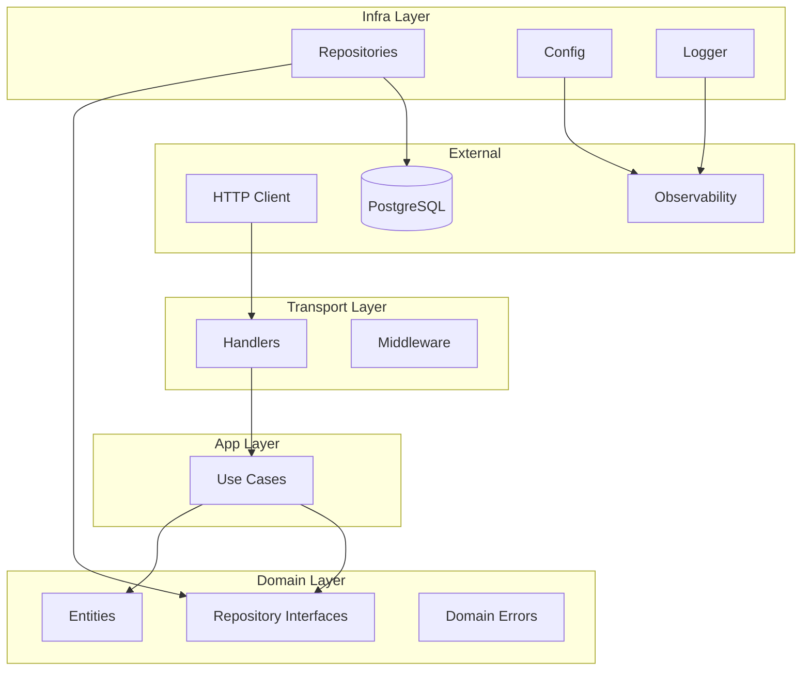

# Story 8.2: Document Architecture and Layer Responsibilities

Status: Done

## Story

As a **developer**,
I want **architecture documentation explaining hexagonal structure**,
so that **I understand where to place code**.

## Acceptance Criteria

1. **Given** I want to understand the architecture, **When** I read `docs/architecture.md`, **Then** I see explanation of:
   - Hexagonal architecture principles
   - Four layers: domain, app, transport, infra
   - Responsibilities of each layer
   - Import rules between layers
   - Diagram showing layer relationships

2. **And** subsection "Boundary Enforcement in Practice" showing:
   - depguard/golangci config location (`.golangci.yml`)
   - Example error message when boundary violated
   - Reference to FR45-FR47

*Covers: FR65*

## Current State Analysis

The `docs/architecture.md` file already exists with substantial architectural content (1457 lines). This story requires **enhancing** the document to include a more accessible developer-oriented guide section.

### Existing Coverage (✅)

- Core architectural decisions documented
- Repository pattern with Querier/TxManager abstraction
- Transaction handling (Unit of Work pattern)
- Authentication & security architecture
- API design standards (RFC 7807, pagination)
- Implementation patterns & naming conventions
- Error handling strategy by layer

### Gaps to Address (⚠️)

1. **Hexagonal Architecture Principles:** Need clear, concise explanation for developers new to hexagonal/ports-and-adapters
2. **Layer Diagram:** Visual representation of layer relationships required
3. **Boundary Enforcement in Practice:** Section documenting depguard rules and example violations
4. **Developer-Oriented Summary:** Quick reference section for "where to put what"

## Tasks / Subtasks

- [x] Task 1: Add Hexagonal Architecture Principles Section (AC: #1)
  - [x] 1.1 Add section explaining hexagonal/ports-and-adapters pattern
  - [x] 1.2 Explain the "ports" concept (domain interfaces)
  - [x] 1.3 Explain the "adapters" concept (infra implementations)
  - [x] 1.4 Add benefits of this architecture for testing and maintainability

- [x] Task 2: Document Four Layers with Responsibilities (AC: #1)
  - [x] 2.1 Domain layer: entities, repository interfaces, domain errors
  - [x] 2.2 App layer: use cases, authorization, transaction boundaries
  - [x] 2.3 Transport layer: HTTP handlers, middleware, DTOs
  - [x] 2.4 Infra layer: database implementations, config, observability

- [x] Task 3: Document Import Rules Between Layers (AC: #1)
  - [x] 3.1 Create table/diagram showing allowed imports per layer
  - [x] 3.2 List FORBIDDEN imports for each layer
  - [x] 3.3 Reference `.golangci.yml` depguard configuration

- [x] Task 4: Create Layer Relationship Diagram (AC: #1)
  - [x] 4.1 Add Mermaid diagram or ASCII showing hexagonal structure
  - [x] 4.2 Show dependency flow: transport → app → domain ← infra

- [x] Task 5: Add "Boundary Enforcement in Practice" Section (AC: #2)
  - [x] 5.1 Document location of depguard configuration
  - [x] 5.2 Provide example lint error message for boundary violation
  - [x] 5.3 Explain how CI fails on violations
  - [x] 5.4 Reference FR45-FR47

- [x] Task 6: Review and Verify (AC: #1, #2)
  - [x] 6.1 Ensure all sections are clear and actionable
  - [x] 6.2 Verify depguard rules match documentation
  - [x] 6.3 Run `make lint` to verify configuration

## Dependencies & Blockers

- **Depends on:** Epic 3 (Local Quality Gates) - Completed
- **Depends on:** Story 3.1 (golangci-lint with boundary rules) - Completed
- **Uses:** Existing `docs/architecture.md` structure
- **Uses:** `.golangci.yml` depguard configuration

## Assumptions & Open Questions

- The existing architecture.md will be enhanced, not replaced
- Developer audience has basic Go knowledge but may be new to hexagonal architecture
- Mermaid diagrams are supported in GitHub markdown

## Definition of Done

- [x] Hexagonal architecture principles documented
- [x] Four layers with responsibilities clearly explained
- [x] Import rules between layers documented with table/diagram
- [x] Layer relationship diagram included (Mermaid or ASCII)
- [x] "Boundary Enforcement in Practice" section added
- [x] Example depguard error message included
- [x] FR45-FR47 referenced appropriately
- [x] Documentation reviewed for clarity

## Non-Functional Requirements

- Documentation should be scannable with clear headers
- Use tables for quick reference
- Include code examples where helpful
- Keep new sections concise (developer-focused, not academic)
- Mermaid diagrams should work on GitHub

## Testing & Verification

### Manual Verification Steps

1. **Read test:** A new developer can understand layer placement after reading
2. **Lint test:** Run `make lint` and verify boundary rules work
3. **Violation test:** Temporarily add forbidden import and verify error message

### Example Verification Commands

```bash
# Verify current lint status
make lint

# Simulate boundary violation (in test file only)
# Add to internal/domain/user.go temporarily:
# import "github.com/google/uuid"
# Then run:
make lint
# Should fail with depguard error

# Expected error format:
# internal/domain/user.go:X:X: import 'github.com/google/uuid' is not allowed by 'domain-layer' rule, because: ... (depguard)
```

## Dev Notes

### Current depguard Rules (from .golangci.yml)

| Layer | Allowed | Denied |
|-------|---------|--------|
| **domain-layer** | `$gostd` only | `log/slog` |
| **app-layer** | `$gostd`, `internal/domain` | `slog`, `otel`, `uuid`, `net/http`, `pgx`, `transport`, `infra` |
| **transport-layer** | (lax mode) | `pgx`, `internal/infra` |
| **infra-layer** | (lax mode) | `internal/app`, `internal/transport` |

### Key Architectural Patterns to Document

1. **Dependency Rule:** Dependencies point inward (transport → app → domain)
2. **Inversion of Control:** Domain defines interfaces, infra implements
3. **Pure Domain:** No external dependencies in domain layer
4. **Separation of Concerns:** Each layer has single responsibility

### Example Mermaid Diagram for Reference



### Project Structure Reference

```
internal/
├── domain/           # Domain layer - NO external deps
│   ├── user.go       # Entity + UserRepository interface
│   ├── querier.go    # Querier interface (DB abstraction)
│   ├── tx.go         # TxManager interface
│   └── errors.go     # Sentinel errors (ErrUserNotFound)
│
├── app/              # App layer - only domain imports
│   └── user/
│       ├── create_user.go   # UseCase with authorization
│       └── get_user.go
│
├── transport/http/   # Transport layer
│   ├── handler/      # HTTP handlers
│   ├── middleware/   # Auth, logging, recovery
│   └── contract/     # DTOs, error responses
│
└── infra/            # Infrastructure layer
    ├── postgres/     # Repository implementations
    ├── config/       # Config with envconfig
    └── observability/# Logging, tracing, metrics
```

### References

- [Source: docs/epics.md#Story 8.2] Lines 1664-1686
- [Source: docs/architecture.md] Existing implementation (1457 lines)
- [Source: docs/project-context.md#Critical Layer Rules] Lines 35-88
- [Source: .golangci.yml] depguard configuration (lines 12-127)
- [Source: FR45] Linting rules detect import violations between layers
- [Source: FR46] CI pipeline fails when boundary violations are detected
- [Source: FR47] Developer receives clear error messages indicating violation

### Epic 8 Context

Epic 8 implements Documentation & Developer Guides:
- **8.1:** README Quick Start ✅ (done)
- **8.2 (this story):** Architecture and Layer Responsibilities
- **8.3:** Local Development Workflow
- **8.4:** Observability Configuration
- **8.5:** Guide for Adding New Modules
- **8.6:** Guide for Adding New Adapters

## Dev Agent Record

### Context Reference

Story context created by: create-story workflow (2025-12-23)

Files analyzed:
- `docs/epics.md` - Story 8.2 acceptance criteria (lines 1664-1686)
- `docs/architecture.md` - Existing architecture documentation
- `docs/project-context.md` - Layer rules and conventions
- `.golangci.yml` - depguard rules configuration
- `docs/sprint-artifacts/8-1-create-readme-quick-start.md` - Previous story for learnings

### Agent Model Used

Claude (Anthropic) - Gemini Antigravity Agent

### Debug Log References

N/A

### Completion Notes List

- Added "Hexagonal Architecture Developer Guide" section to `docs/architecture.md` with:
  - ASCII diagram explaining hexagonal/ports-and-adapters concept
  - Core concepts table (Ports, Adapters, Driving/Driven)
  - Benefits of hexagonal architecture (testability, maintainability, flexibility)
  - Mermaid flowchart diagram showing four layers with color coding
  - Detailed documentation for all four layers (Domain, App, Transport, Infra) with code examples
  - Import rules table with allowed/forbidden imports per layer
  - ASCII diagram showing import direction flow
  - "Boundary Enforcement in Practice" section with:
    - depguard configuration location (.golangci.yml)
    - Example violation and error message
    - CI integration explanation
    - FR45-FR47 references
- Updated `.golangci.yml` to version 2 format for golangci-lint compatibility
- Updated `go.mod` Go version from 1.24.11 to 1.24.10 for local compatibility

### File List

**Modified:**
- `docs/architecture.md` - Added Hexagonal Architecture Developer Guide section (~400 lines)
- `.golangci.yml` - Updated to golangci-lint v2.x format (added version key, fixed output.formats)
- `go.mod` - Updated Go version from 1.24.11 to 1.24.10

### Change Log

- 2025-12-23: Added Hexagonal Architecture Developer Guide section covering AC #1 and #2
